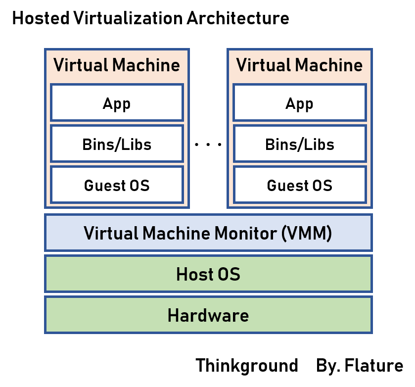
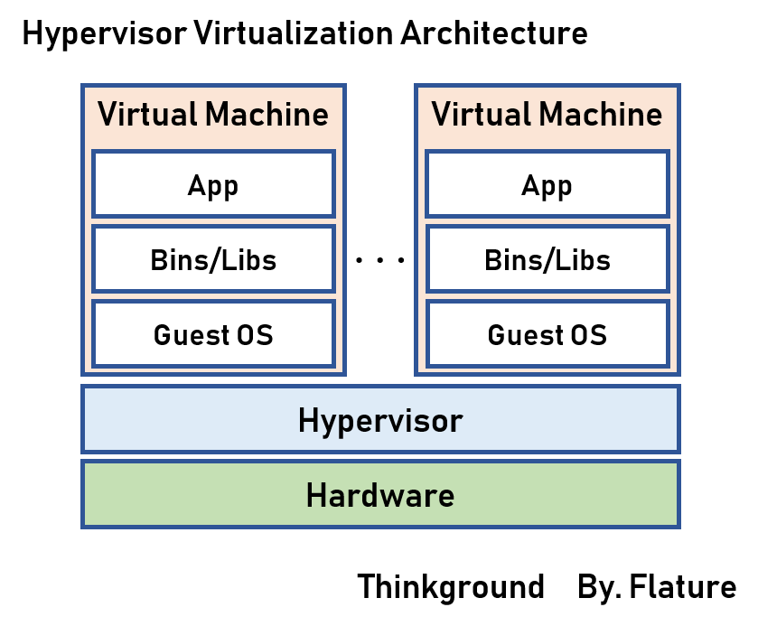
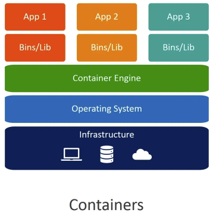

# 가상화
서버 가상화란, 컴퓨터 리소스를 관리하기 위한 다양한 기술들을 말한다.

--Todo: 완벽히 이해 못함--
예를덜어, 하나의 서버 안에 네트워크나 스토리지를 가상으로 준비하여, 여러개의 다른 서버가 동작하는 것처럼 보이게 하는 기술이다.

서버 가상화는 물리적인 서버와 소프트웨어 사이에 **가상화 소프트웨어**를 끼워 넣음으로써 실현된다.

가상화 소프트웨어를 어디에 설치할지, 가상화 소프트웨어가 **무엇을 관리할지**에 따라 몇가지 패턴으로 분류된다.

***

# 호스트형 가상화
호스트형 가상화를 실현하는 **가상화 소프트웨어**는 **Host OS**에 설치되며, **Guest OS**를 관리한다.

즉, 물리적인 머신 위에 직접 동작하는 **Host OS** 위에서 실행돼는 **가상화 소프트웨어** 에 설치된 OS를 **Geest OS** 라 부른다.

장점
* 이미 사용중인 기계에 가상 서버를 구축하는 경우 유용
* 호스트 OS가 있기 때문에 브라우저나 에디터 같은 응용 프로그램도 평소러럼 계속 사용 가능

단점
* OS 위에 OS가 얹히는 방식이기 때문에 오버헤드가 클수 있다.

Host OS 가상화에 대한 소프트웨어는 이하와 같다.
* VMware Workstation
* Microsoft Virtual PC
* VirtualBox

***

# 하이퍼바이저형 가상화
**Host OS 없이** 하드웨어에 하이퍼 바이저를 설치하여 사용하는 가상화 방식이다.

**하이퍼바이저** 라는 소프트웨어를 하으웨어 위에 직접 움직여, 하이퍼바이저 위에 각각의 가상머신을 움직이게 한다.

가상머신이 마치 **독립한 호스트 시스템**과 같이 행동한다는 점으로, 이는 하이퍼바이저가 복수의 가상머신이 서로 간섭하지 않도록 해주기 때문이다.

**하이퍼바이저**형은 별도의 개별 시스템처럼 행동하기 때문에, 호스트형 가상화 만큼의 처리 오버헤드가 존재하지 않아, 호스트형 가상화보다 퍼포먼스가 좋다.

현재 서버 가상화 기술에서는 주류 방식으로 사용되고 있다.

장점
* 별도의 Host OS가 없기 때문에 오버헤드가 적고, 하드웨어를 직접 제어하기 때문에 보다 효율적

단점
* 자체적으로 머신에 대한 관리기능이 없기 때문에 관리를 위한 컴퓨터나 콘솔(CLI) 이 필요하다.

하이퍼바이저형의 가상화 소프트웨어는 이하와 같다.
* VMware ESX Server (전가상화)
* MS Hyper-v (전가상화)
* Citrix XenServer (반가상화)

***

# 컨테이너 가상화
호스트OS 위에 **컨테이너관리 소프트웨어** 를 설치하여, 논리적으로 컨테이너를 나누어 사용한다.

컨테이너형의 경우 OS 가상화나 가상 하드웨어를 포함하지 않고, 소프트웨어를 가상화 하는것에 목적을 둔다. 죽, 컨테이너는 **Application으로만 구성되어 있으며** 이를 각각 개별 서버처럼 사용 가능하다.

장점
* Guest OS의 구동이 필요 없기 때문에, 앱 구동이 압도적으로 빠르다.

응용 방법
* 매우 가벼워 테스트를 실행하는 컨테이너를 준비하고, 테스트 중에만 시작하여 몇분만 폐기하는 작은 사이클에 통합 가능하다.
* 호스트형 가상화로 로컬 개발을 하고 있고, 배포 대상 서버에서 하이퍼바이저형 가상화가 이루어지고 있다면, 로컬에서 시작하는 것과 서버에 배포하는 것이 일치하기 때문에 배포는 어느 정도 간단하다.
* 가상화가 로컬에서만 이루어져도, 개발자의 환경을 통일하기 쉬운 등의 장점이 충분히 있기 때문에, 이 자체는 문제가 되지 않다.

## 컨테이너 가상화의 주의사항
컨테이너에 OS는 포함되어 있지 않지만, **있는 것처럼** 보인다.

컨테이너형 가상화틑 Guest OS를 시작하지 않지만, Docker에 의해 마치 Linux가 시작된 것처럼 보일수 있다. 따라서 컨테이너 내에서는 병험하게 ls나 cd 명령어를 사용 가능하다.

실제 사용감은 Ubuntu나 CentOS등을 조작하는 것과 크게 다르지 않을 거다.

가상서버 만큼 완전한 분리나 에뮬레이트는 이루어 지지 않는다.

**컨테이너의 커널은 호스트 기계의 Linux 커널이다.** Ubuntu나 CentOS처럼 보이지만 실제로 OS가 시작되지 않기 때문에, 컨테이너의 커널은 호스트 기계의 Linux 커널이 된다. 이는 가상 서버처럼 하드웨어를 에뮬레이트 하지 않으며, 호스트 OS(또는 그 위의 Linux)와의 분리도가 낮다는 점에 주의가 필요하다.

Docker 컨테이너는 Linux의 커널과 기능을 사용하여 작동하기 때문에, 컨테이너의 OS도 필연적으로 Linux로 제한된다. 예를들어, Ubuntu 컨테이너와 Window Server 컨테이너는 공존할수 없다.

컨테이너는 가상화 기술이지만, 호스트 OS의 영향을 완전히 받지 않는것은 아니다. 컨테이너는 Guest OS가 포함되어 있지 않아 호스트 기계 위의 Linux 커널을 사용하기 때문에, 호스트 OS의 차이가 컨테이너에 영향을 줄 수 있다. 예를들어 최근 M1 MAc 에서 Docker가 작동하지 않는 문제가 종종 보고디어 왔다.