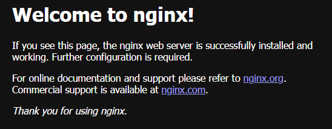
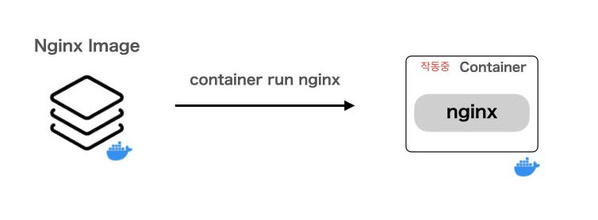

# 컨테이너 기초
컨테이너를 조작하는 몇가지 명령어를 사용하여 컨테이너를 시작하고 중지할 수 있습니다.

명령어 목록을 외우는 것만으로는 이해도 향상에 어려움이 있습니다.

하지만 기본적인 최소한의 작업은 외워두는것이 편합니다.

다음은 기본적인 작업을 실행하기 위한 명령어들 입니다.

***

# container run - 컨테이너 실행
```shell
docker container run [옵션] <이미지> [명령]
```

## 최소한의 옵션으로 Nginx 웹서버 실행해보기
단순히 실행만 하고 싶으므로 `<image>` 에는 `nginx`만 지정하겠습니다.

`--publish` 와 `Port` 부분은 나중에 다루겠습니다.

`[notice] 1#1: start worker processes` 메시지와 함께 터미널이 조작 불가능해지면 실행이 성공한 것입니다.

```shell
C:\Users\[username]>docker container run --publish 8080:80 nginx
Unable to find image 'nginx:latest' locally
latest: Pulling from library/nginx
09f376ebb190: Pull complete
5529e0792248: Pull complete
9b3addd3eb3d: Pull complete
57910a8c4316: Pull complete
7b5f78f21449: Pull complete
b7923aa4e8a6: Pull complete
785625911f12: Pull complete
Digest: sha256:0f04e4f646a3f14bf31d8bc8d885b6c951fdcf42589d06845f64d18aec6a3c4d
Status: Downloaded newer image for nginx:latest
/docker-entrypoint.sh: /docker-entrypoint.d/ is not empty, will attempt to perform configuration
/docker-entrypoint.sh: Looking for shell scripts in /docker-entrypoint.d/
/docker-entrypoint.sh: Launching /docker-entrypoint.d/10-listen-on-ipv6-by-default.sh
10-listen-on-ipv6-by-default.sh: info: Getting the checksum of /etc/nginx/conf.d/default.conf
10-listen-on-ipv6-by-default.sh: info: Enabled listen on IPv6 in /etc/nginx/conf.d/default.conf
/docker-entrypoint.sh: Sourcing /docker-entrypoint.d/15-local-resolvers.envsh
/docker-entrypoint.sh: Launching /docker-entrypoint.d/20-envsubst-on-templates.sh
/docker-entrypoint.sh: Launching /docker-entrypoint.d/30-tune-worker-processes.sh
/docker-entrypoint.sh: Configuration complete; ready for start up
2024/06/03 02:00:57 [notice] 1#1: using the "epoll" event method
2024/06/03 02:00:57 [notice] 1#1: nginx/1.27.0
2024/06/03 02:00:57 [notice] 1#1: built by gcc 12.2.0 (Debian 12.2.0-14)
2024/06/03 02:00:57 [notice] 1#1: OS: Linux 5.15.146.1-microsoft-standard-WSL2
2024/06/03 02:00:57 [notice] 1#1: getrlimit(RLIMIT_NOFILE): 1048576:1048576
2024/06/03 02:00:57 [notice] 1#1: start worker processes
2024/06/03 02:00:57 [notice] 1#1: start worker process 29
2024/06/03 02:00:57 [notice] 1#1: start worker process 30
2024/06/03 02:00:57 [notice] 1#1: start worker process 31
2024/06/03 02:00:57 [notice] 1#1: start worker process 32
2024/06/03 02:00:57 [notice] 1#1: start worker process 33
2024/06/03 02:00:57 [notice] 1#1: start worker process 34
2024/06/03 02:00:57 [notice] 1#1: start worker process 35
2024/06/03 02:00:57 [notice] 1#1: start worker process 36
2024/06/03 02:00:57 [notice] 1#1: start worker process 37
2024/06/03 02:00:57 [notice] 1#1: start worker process 38
2024/06/03 02:00:57 [notice] 1#1: start worker process 39
2024/06/03 02:00:57 [notice] 1#1: start worker process 40
2024/06/03 02:00:57 [notice] 1#1: start worker process 41
2024/06/03 02:00:57 [notice] 1#1: start worker process 42
2024/06/03 02:00:57 [notice] 1#1: start worker process 43
2024/06/03 02:00:57 [notice] 1#1: start worker process 44
2024/06/03 02:00:57 [notice] 1#1: start worker process 45
2024/06/03 02:00:57 [notice] 1#1: start worker process 46
2024/06/03 02:00:57 [notice] 1#1: start worker process 47
2024/06/03 02:00:57 [notice] 1#1: start worker process 48
```

브라우저에서 [http://localhost:8080](http://localhost:8080) 에 접속해 보세요.

다음과 같은 화면이 나타나면 실행한 컨테이너의 웹 서버에 접근할 수 있습니다.



컨테이너 자체는 가상 서버가 아니지만, 실행한 컨테이너(격리 영역) 내에서 Nginx 웹서버가 실행되고 있습니다.

이미지에서 컨테이너를 시작했으므로 형재 상황은 다음과 같이 나타낼 수 있습니다.




***

# container ls - 컨테이너 목록 확인
```shell
docker container ls [옵션]
```

## 실행중인 컨테이너 목록 확인
```shell
C:\Users\[username]>docker container ls
CONTAINER ID   IMAGE     COMMAND                   CREATED          STATUS         PORTS                  NAMES
41414758eaa3   nginx     "/docker-entrypoint.…"   31 minutes ago   Up 8 minutes   0.0.0.0:8080->80/tcp   sad_mendel
```

`IMAGE`가 `nginx`인 컨테이너가 하나 실행되었음을 확인할 수 있습니다.

`CONTAINER ID` 는 `41414758eaa3` 이며, `NAMES`는 `sad_mendel` 입니다.

여기서 `NAMES` 는 컨테이너를 실행할 때마다 무작위로 할당됩니다.

***

# container stop - 컨테이너 중지
```shell
docker container stop [옵션] <컨테이너>
```

Nginx를 사용한 작업이 끝나 컨테이너를 중지하려면 `container stop [옵션] <컨테이너>` 명령어를 사용하면 된다.

`container stop` 의 경우 대부분 옵션이 필요하지 않으며, `<container>`는 `CONTAINER ID` 또는 `NAMES` 로 지정하여 실행할 수 있다.

컨테이너가 정상적으로 중지되면 더이상 [http://localhost:8080](http://localhost:8080) 에 접속 돼지 않으며, 실행 중인 컨테이너 목록을 확인해도 Nginx 컨테이너가 더이상 표시되지 않는다.

```shell
C:\Users\[username]>docker container stop sad_mendel
sad_mendel

C:\Users\[username]>docker container ls
CONTAINER ID   IMAGE     COMMAND   CREATED   STATUS    PORTS     NAMES
```

## 모든 컨테이너 목록 확인
컨테이너는 중지되어도 삭제되기 전까지 호스트 머신에 정보로 남아 있으며, 다시 시작할 수도 있습니다.

중지된 컨테이너를 포함하여 모든 컨테이너 목록을 확인하려면 `container ls` 에 `--all` or `-a` 옵션을 추가하여 실행하면 됩니다.

```shell
C:\Users\[username]>docker container ls -a
CONTAINER ID   IMAGE     COMMAND                   CREATED       STATUS                     PORTS     NAMES
41414758eaa3   nginx     "/docker-entrypoint.…"   5 hours ago   Exited (0) 3 minutes ago             sad_mendel
```

***

# container rm - 컨테이너 삭제
```shell
docker container rm [옵션] <컨테이너>
```

`container stop`과 마찬가지로 `<컨테이너>`를 지정하는 명령어이므로, `container ls`에서 확인한 `CONTAINER ID` or `NAMES` 를 사용하여 실행합니다.

```shell
C:\Users\[username]>docker container rm sad_mendel
sad_mendel

C:\Users\[username]>docker container ls -a
CONTAINER ID   IMAGE     COMMAND   CREATED   STATUS    PORTS     NAMES

```

이제 컨테이너가 완전히 삭제되었습니다, 더이상 컨테이너 목록을 확인해도 Nginx 컨테이너가 표시되지 않습니다.

## 실행중인 컨테이너를 중지하지 않고 바로 삭제하기
실행중인 컨테이너에 삭제 명령을 하면 `Error response from daemon: cannot remove container "/nervous_shamir": container is running: stop the container before removing or force remove` 라는 에러 메세지가 출력됍니다.

```shell
C:\Users\[username]>docker container ls
CONTAINER ID   IMAGE          COMMAND                   CREATED          STATUS          PORTS     NAMES
cd34bb77f8b5   nginx:latest   "/docker-entrypoint.…"   17 seconds ago   Up 16 seconds   80/tcp    nervous_shamir

C:\Users\[username]>docker container rm nervous_shamir
Error response from daemon: cannot remove container "/nervous_shamir": container is running: stop the container before removing or force remove
```

`--force` 옵션을 사용하면 `container stop` 과 `container rm` 한번에 실행 할 수 있습니다.
```shell
C:\Users\dawon>docker container rm --force nervous_shamir
nervous_shamir

C:\Users\dawon>docker container ls -a
CONTAINER ID   IMAGE     COMMAND   CREATED   STATUS    PORTS     NAMES

```

보통 **정지된 컨테이너**는 다시 시작할 수 있지만, 거의 다시 시작 하지 않는 경우가 많습니다. 그렇기에 강제삭제 옵션인 `--force`를 사용하면 조금더 간단하게 컨테이너를 조작할 수 있습니다.

***

# container run 옵션
컨테이너를 시작하고 중지하는 방법을 이해했다면, 이제 `container run` 명령의 옵션에 대해 배워봅시다.

**옵션 종류**
1. `-i` or `--interactive` : 컨테이너의 표준 입력에 연결
2. `-t` or `--tty` : 가상 터미널 할당
3. `-d` or `--detach` : 백그라운드에서 실행
4. `--rm` : 중지된 컨테이너 자동 삭제 (중복 정보 충돌 방지)
5. `--name` : 컨테이너에 이름 지정 (쉽게 참조 가능)
6. `--platform` : 이미지 아키텍처 명시 (M1 Mac에서 필요한 경우)

# 백그라운드에서 컨테이너를 실행하기
컨테이너를 **백그라운드**에서 실행하려면 `--detach` 옵션을 사용할 수 있습니다.

이 옵션을 사용하면 Nginx 컨테이너와 같이 백그라운드에서 실행되는 상주 프로세스를 시작할 때 터미널이 컨테이너 출력으로 블로킹 되지 않습니다.

```shell
C:\Users\[username]>docker container run -d --publish 8080:80 nginx
5b1af132fd37f0326326c97c79c3cfdb6d9dff43bc5bd7ffc88134490b286de9

C:\Users\[username]>
```

다음과 같이 **컨테이너 ID**만 표시되며, 컨테이너 목록 확인, 중지 또는 삭제와 같은 작업또한 동일하게 수행할 수 있습니다.

```shell
C:\Users\[username]>docker container rm --force 5b1af132fd37f0326326c97c79c3cfdb6d9dff43bc5bd7ffc88134490b286de9
5b1af132fd37f0326326c97c79c3cfdb6d9dff43bc5bd7ffc88134490b286de9
```
# container 이름 지정 AND 자동 삭제
컨테이너에 이름을 지정하려면 `--name` 옵션을 사용할 수 있습니다. 이 옵션을 사용하면 매번 무작위로 할당되는 컨테이너 이름을 지정할 수 있습니다.


컨테이너가 중지될 때 자동으로 삭제하려면 `--rm` 옵션을 사용하면 됩니다.

```shell
C:\Users\[username]>docker container run --name custom-name --rm --detach --publish 8080:80 nginx
eb6ff6d6d79d3c82472e1c47f6c815b100a0ef5285a28b6c53d3972225f1a42f

C:\Users\[username]>docker container ls
CONTAINER ID   IMAGE     COMMAND                   CREATED         STATUS         PORTS                  NAMES
eb6ff6d6d79d   nginx     "/docker-entrypoint.…"   5 seconds ago   Up 5 seconds   0.0.0.0:8080->80/tcp   custom-name

C:\Users\[username]>docker container stop custom-name
custom-name

C:\Users\[username]>docker container ls
CONTAINER ID   IMAGE     COMMAND   CREATED   STATUS    PORTS     NAMES

```

한가지 주의할 점은 컨테이너 지정에 사용되는 NAMES는 **고유한 값**이여야 합니다(중지된 컨테이너 포함).

# STDIN
`--interactive` 는 컨테이너의 **STDIN**을 열고 유지 시킵니다. 이는 표준 입력을 통해 container에 입력을 할 수 있다는 의미입니다.


# Allocate a pseudo-TTY
`--tty` 플래그는 컨테이너에 pseudo-TTY를 연결하여 터미널을 컨테이너의 I/O 스트림에 연결합니다.

