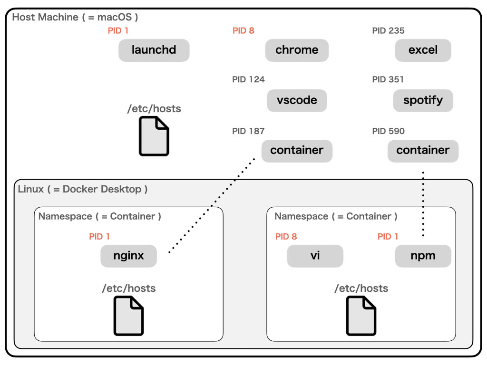
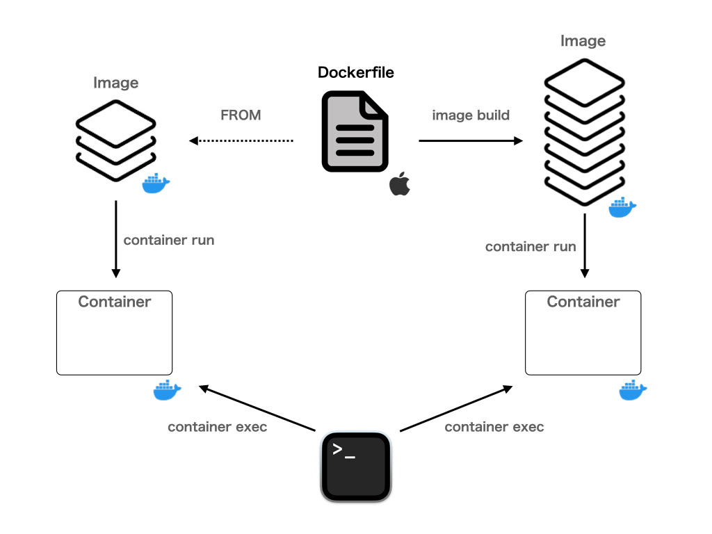

# Docker
컨테이너 기반 가상화를 사용하여 Application의 개발과 배포를 수행하는 Docker 사의 개발 플랫폼

Docker 가 무엇인지 정의하는것은 어렵지만, Docker의 발전에 따라 다양한 구성요소를 포함하게 되었고, 현재는 Docker가 플랫폼을 의미하는것처럼 여겨지기도 한다.

Docker에 포함된 요소들
* Docker Engin
* Docker CLI
* Docker Desktop
* Docker Compose
* Docker Hub
* ECS / GKE (해당 강의해선 다루지 않는다)
* ECR / GCR (해당 강의해선 다루지 않는다)
* Kubernetes (해당 강의해선 다루지 않는다)

## Docker Engine
Docker Engine은 앞에서 설명한 "가상화"에서 소개한 컨테이너 기반 가상화 소프트웨어의 한 부분

이를 통해 애플리케이션을 컨테이너로 다룰 수 있게 된다.

Docker 컨테이너는 리눅스 커널과 기능을 사용하여 동작하기 때문에, Docker Engine은 리눅스에서만 동작한다.

## Docker CLI
Docker Engine에 제공되는 것으로, docker run, docker build와 같은 docker로 시작하는 명령어로 Docker에 명령할 수 있다.

## Docker Desktop
Windows나 Mac에서 Docker를 사용하기 위한 GUI 애플리케이션으로 Docker CLI 대신 GUI로 컨테이너 등을 확인하거나 중지할 수 있다.

Docker Desktop에는 Docker Engine과 리눅스 커널이 포함되어 있어, 리눅스 이외의 OS에서도 Docker Engine을 동작시킬 수 있게 된다.

일반적으로 "Windows나 Mac에 호스트 머신에 Docker를 설치한다"는 것은 "Docker Desktop 애플리케이션을 설치한다"는 뜻이 될 것이다.

Docker Desktop에는 Docker Compose와 Kubernetes도 포함되어 있으며, Docker Hub에서 다운로드할 수 있다.

## Docker Compose
Docker Compose는 Docker CLI를 일괄 실행해주는 편리한 도구로, "2개의 컨테이너를 시작하고" "각각의 네트워크를 구축하고" "컨테이너의 데이터를 호스트 머신과 공유하는" 등의 복잡한 명령어를 YAML 파일을 작성함으로써 실현할 수 있는 있다.

요약하자면 docker 명령어를 일괄 실행해주는 것과 같은 것이다.

## Docker Hub
Docker Hub는 Docker의 이미지 레지스트리인 SaaS 서비스

공개된 이미지를 git pull하거나, 구축한 이미지를 git push할 수 있는 곳으로 이해하시면 된다.

요약하자면 이미지의 GitHub과 같은 것

## ECS / GKE
Amazon Elastic Container Service(ECS)와 Google Kubernetes Engine(GKE) 라는 컨테이너 관리 서비스

## ECR / GCR
Amazon Elastic Container Registry(ECR)와 Google Container Registry(GCR)는 비공개 이미지의 레지스트리

요약하자면 프라이빗 Docker Hub와 같은 것

## Kubernetes
Kubernetes(약자로 k8s라고도 함)는 다수의 컨테이너를 관리하는 오케스트레이션 소프트웨어로, kubectl apply와 같은 kubectl로 시작하는 명령어를 제공해 줍니다.

오케스트레이션을 통해 로드밸런서 생성, 접속 집중 시 확장 등을 쉽게 실현할 수 있게 됩니다.

요약하자면 컨테이너를 운영하기 위한 도구입니다.

Kubernetes도 Docker Desktop에 포함되어 있지만, 개발 환경 구축에 여기까지 필요하게 되는 경우는 거의 없으므로, 이 글에서는 Kubernetes는 사용하지 않습니다.

참고로 오케스트레이션 도구는 docker 명령어가 아니라 dockerd나 container를 직접 사용합니다.

***

# Docker 기본 개념
Docker를 명령어 목록이나 옵션 목록에서 이해하려고 해도, 단순히 지식을 모으는 것만으로는 기본을 제대로 이해하고 활용할 수 없습니다.

단순히 많은 명령어를 따라 실행하고 "흐음...??"이 되는 것보다는, 먼저 조금의 시간을 내어 기본을 탄탄히 이해하는 것이 더 중요합니다.

## Docker의 기본 요 소
개발환경을 Docker로 구축할 때, 실제로 필요한 요소는 그리 많지 않다. 이 글에선 다음 3가지를 기본 요소로 간주 한다.
1. 컨테이너
2. 이미지
3. Dockerfile

## 컨테이너
컨테이너는 특정 명령을 실행하기 위해 호스트 머신 상에서 **격리된 영역**을 가리킨다.

컨테이너는 호스트 머신에서 실행중인 가상 OS처럼 느껴질수 있지만, 컨테이너는 본질적으로 Linux의 Namespace라는 기능에 의해 다른것들과 분리된 단순한 **프로세스**일 뿐이다.

정리하면, Docker는 Linux의 Namespace라는 기능을 컨테이너나 이미지 같은 개념을 사용하여 쉽게 다룰수 있도록 만든 기술이라 할수 있다.

위 그림에서 호스트 머신 및 각 컨테이너에는 PID(Process ID)1과 /etc/hosts 등의 파일이 중복되어 있지만, Namespace에 의해 격리된 영역을 매핑하여 충돌을 피하고 있다.

Docker는 이러한 Namespace를 **이미로부터** 생성하여 서로 다른 OS처럼 보이도록 하거나, Namespace를 쉽게 생성하거나 삭제할 수 있는 명령을 제공한다. 이를 통해 컨테이녀형 가상화에서는 OS가 포함되어 있지 않고, **호스트 머신의 커널**을 사용한다 라는것이 이해하기 쉬울것이다.

컨테이너는 결국 호스트 머신의 단순한 **프로세스** 이며, 가상 서버가 아니다.

컨테이너의 특징은 다음과 같이 정리 할 수 있다.
1. 컨테이너는 이미지를 기반으로 생성된다.
2. Docker의 CLI 또는 API를 사용하여 생성, 시작 및 중지할 수 있다.
3. 여러 컨테이너는 서로 독립적이며 영향을 미치지 않고 독립적으로 작동한다.
4. Docker Engine 위에서 로컬 머신이든 가상 머신이든 클라우드 환경이든 어디서든 실행 할 수 있다.

## 이미지
보통 OS에서 이미지란,

Docker에서 이미지란, 컨테이너를 실행하는 데 필요한 패키지로, **파일 및 메타정보**를 모아놓은 것이다.

[TODO: 이해 못함, 그러면 어떻게 있다는 거야? 메모리에 바이너리로 있다는거야?]
이미지는 여러 레이어로 구성된 정보를 의미하며, 호스트 머신의 어느곳에도 .img 같은 구체적인 단일파일이 존재하지 않다.

이미지에는 다음과 같은 정보가 레이어별로 포함되어 있다.
1. **베이스 이미지**: 어떤 기반이 되는지
2. **설치된 내용**: 어떤 소프트웨어나 패키지가 설치되어 있는지
3. **환경 변수**: 어떤 환경 변수가 설정되어 있는지
4. **설정 파일**: 어떤 설정파일이 구성되어 있는지
5. **기본 명령어**: 기본적으로 실행되는 명령어가 무엇인지

이미지는 Docker Hub에서 공개외어 있다. (Docker Hub에 공개되어 있는것은 Dockerfile이 아니다)

## Dockerfile
Dockerfile은 기존 이미지에 추가적인 레이러를 쌓기 위한 **텍스트 파일**이다.

인터넷에서 공개된 이미지에 설치된 명령이 부족한 경우, Dockerfile을 작성하여 자신만의 편리한 이미지를 만들 수 있습니다.

이미지를 만드는 것이 어려워 보일 수 있지만, 공개된 이미지에 Dockerfile로 레이어를 추가하는 것만으로도 OS에서 구축하는 번거로움 없이 간단하게 가능합니다.

Dockerfile은 주로 GitHub와 같은 곳에서 공유됩니다. (Git으로 관리되는 것은 이미지가 아닙니다.)

## 기본 명령어 3가지
이 3가지 요소를 중심으로 생각하면, 명령어의 기본 형태도 3가지로 분류 할 수있다.
1. **컨테이너 실행**: 컨테이너를 시작합니다.
2. **이미지 생성**: 이미지를 만듭니다.
3. **컨테이너 조작**: 컨테이너를 조작합니다.

위 그림에서 보다싶이, 화살표의 끝이 컨테이너라면 `container [행동]`로, 화살표의 끝이 이미지라면 `image [행동]` 로 되어 있을 것입니다.

즉, `docker container run` 이나 `docker image build`는 `docker [무엇] [행동]` 로 해석하면 편합니다.

### container run
이미지러부터 컨테이너를 시작하는 명령, `container run` 에는 많은 옵션이 있으며, 컨테이너의 목적에 따라 다양한 옵션을 사용해야 한다.

옵션이 정말 많이 깨문에, 필요한 순간 찾아서 하나씩 이해하는것으로 충분하다.

또한, `container run` 이라는 명령어는 사실 다음 명령을 한번에 수행하는 명령어다.

그러나 이 글에서는 개별 명령어를 설명하지 않고, `container run`으로 설명하겠다.
1. `image pull`
2. `container create`
3. `container start`

그러나 기본적으로 **이미지로부터 컨테이너를 하나 생성하는 명령어** 라는 점을 잊지 마세요.

### image build
Dockerfile 로부터 **이미지를 생성**하는 명령, 이미 설명한대로, **Dockerfile은 기본 이미지를 지정**하고, **명령 설치** 또는 **설정 파일 배치** 와 같은 레이어를 쌓아 **새로운 이미지**를 만드는데 사용된다.

### container [행동]
예를들어 `container exec`는 컨테이너에 명령을 보내는 명령 입니다.

대상이 컨테이너 이므로 필연적으로 `container run` 이후에 사용하는 명령이기도 합니다.

이미지나 Dockerfile 에는 **명령을 내릴수 없습니다.**

`container exec`를 통해 **로그를 보여줘**, **컴파일 해봐**, **테스트 실행해봐** 와 같은 명령을 실행하여 실행 중인 컨테이너에 다양한 작업을 수행할 수 있습니다.

또한, `container stop` 와 같이 컨테이너를 중지하는 명령을 포함하여 컨테이너를 대상으로 하는 다양한 명령이 존재합니다.

## 새로운 명령어와 이전 명령어에 대해
일반적으로 Docker를 사용하시는 분들은 이미 알고 있겠지만, 이 글에서는 `docker run`이 아닌 `docker container run`을 사용하고 있습니다.

실제로 Docker의 명령어는 2017년 1월에 출시간 v1.13에서 큰 변화가 있었으며, `docker run` 이전 명령어이고, `docker container run`은 새로운 명령어로 변경되었습니다.

이는 `docker run` 이나 `docker build`와 같은 Docker 하위 명령어가 너무 많아져서 무엇이 무엇인지 혼동되기 때문입니다.

따라서 v1.13 부터는 명시적으로 대상을 지정할 수 있는 서브커맨드 형식을 사용하는것이 권장됩니다.

보통 보시는 명령어는 아마도 `docker run` 이나 `docker build` 와 같은 이전 명령어가 많을것으로 생각됩니다.

해당 글에선 이전 명령어보단 명확한 새로운 명령어를 사용하여 설명하겠습니다.

타이핑 수는 많아질 수 있지만, 더욱 명확하기에 이해하기 더 쉬울것입니다.

| 이전 명령어 | 새로운 명령어 |
|------------|----------------|
| docker build | docker image build |
| docker run | docker container run |
| docker pull | docker image pull |
| docker create | docker container create |
| docker start | docker container start |
| docker images | docker image ls |
| docker ps | docker container ls |

## Docker와 주변 도구 구분하기
Docker를 사용하는데 있어 몇가지 전제 조건이 있으므로 초보자는 이를 Docker 자체와 혼동하지 않도록 주의해야 합니다.

### Docker Compose
Docker Compose는 Yaml 파일을 작성하여 **여러 컨테이너를 함께 시작하거나 관리하는 도구** 입니다.

Docker Compose는 Docker Desktop에 포함되어 있으며, `docker compose [행동]` 와 같은 명령어 체계를 사용합니다.

Docker CLI만 사용하여 환경을 구축하려면 많은 복잡한 명령을 반복적으로 실행해야 하므로 Docker 명령어 메뉴얼이 필요합니다.

이문제를 Docker Compose를 사용하여 모든 상세 명령을 Yaml에 작성하고 Github에서 공유 하는 방법으로 해결할 수 있습니다.

소프트웨어 엔지니어로서 Docker를 사용하여 개발 환경을 구축하는 경우 Docker Compose는 필수 기술 입니다.

이 책에서는 **Docker를 올바르게 이해하기** -> **Docker를 사용하여 환경 구축하기** -> **Docker Compose로 간편하게 전환하기** 라는 순서로 소개하며, 최종적으로는 `compose up` 명령만으로 복잡한 구성을 즉시 시작 할 수 있는 상태를 목표로 합니다.

### Kubernetes
Kubernetes는 컨테이너화된 애플리케이션의 **자동 디플로이**, **스케일링** 등을 제공하는 **관리시스템**으로, 오픈 소스 기반이다. 원래 구글에 의해 설계되었고 현재 리눅스 재단에 의해 관리되고 있다.

다음은 Kubernetes의 주요 특징입니다.
1. **행성 규모 확장성**: Kubernetes는 운영팀의 규모를 늘리지 않고도 서비스를 확장 할수 있게 해줍니다.
2. **무한한 유연성**: 지역적인 테스트든 글로벌 기업 운영이든 상관없이 Kubernetes의 유연성은 사용자의 복잡한 니즈를 모두 수용 할 수 있습니다.
3. **자가 치유**: 실패한 컨테이너를 재시작하고, 노드가 죽는 경우 컨테이너를 교체하며, 사용자가 정의한 상태 체크에 응답하지 않는 컨테이너를 종료시킵니다.
4. **스토리지 오케스트레이션**: 로컬 스토리지부터 퍼블릭 클라우드 공급자의 스토리지 시스템까지 다양한 스토리지 시스템을 자동으로 마운트합니다.
5. **시크릿과 구성 관리**: 사용자의 이미지를 다시 빌드하거나 스택 구성의 시크릿을 노출하지 않고 시크릿과 Application 구성을 배포하고 업데이트 합니다.
6. **자동 bin packing**: 리소스 요구 사항과 기타 제약 조건에 따라 컨테이너를 자동으로 배치하면서 가용성은 그대로 유지합니다.
7. **배치 실행**: 배치와 CI 워크로드를 관리할 수 있으며, 실패한 컨테이너를 고체할 수 있습니다.

