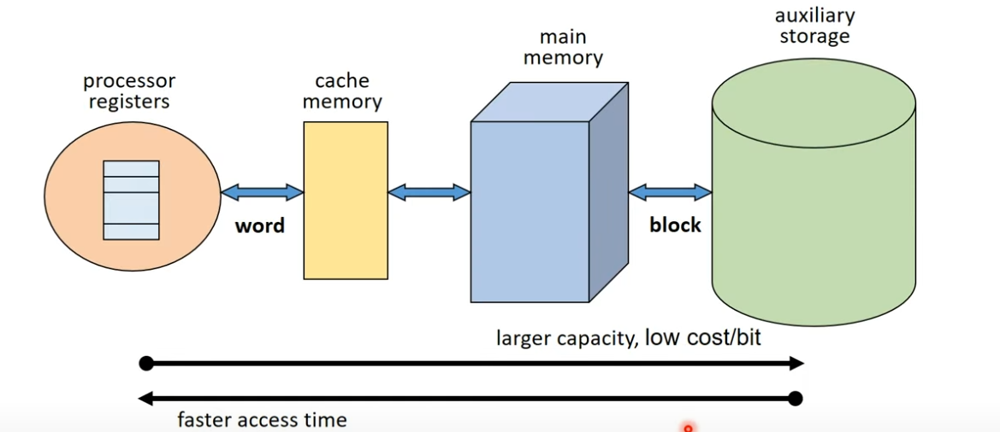
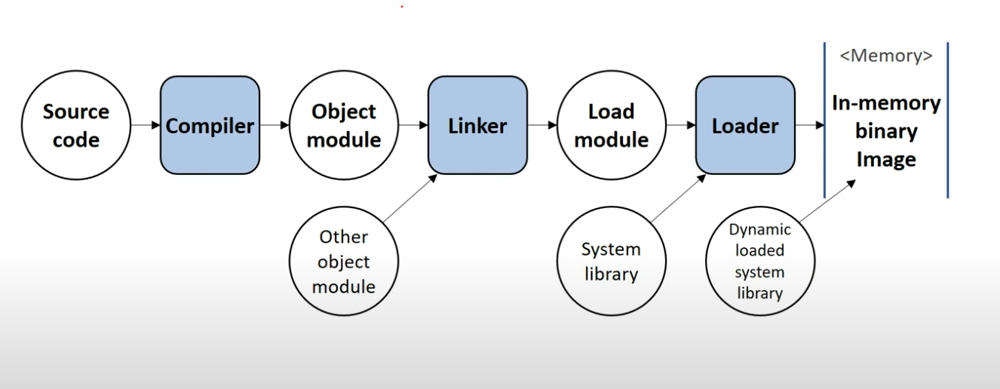

# 메모리(주기억장치) 관리

일반적으로 메모리라 하면 보통 메인메모리를 말한다.

이러한 계층구조를 가지게 된 원인은 앞에서 말한것처럼 I/O bottleneck 을 해소하기 위해 이러한 계층구조를 가지게 돼었다.

이러한 계층구조를 다시 HW가 관리하는지, SW가 관리하는지 2가지 로 나눌수 있다.

**HW가 관리 (CPU 내부에 있는 메모리)**
* 레지스터
* 캐시

**SW가 관리 (여기서 말하는 SW는 OS를 의미한다)**
* 메인 메모리
* 보조 기억장치

# Block & Word

어떠한 데이터를 **Disk**에서 **1bit** 읽는다고 하였을때, 메모리에 얼마만큼 올라가게 됄까?

정답은 OS가 **Disk** 에서 **주기억장치** 로 데이터를 올릴 최소 단위에 의해 결정된다. 그 단위를 부르는 용어가 **Block** 이다.

즉, **Block**이란 **보조기억장치** 와 **주기억장치** 사이의 데이터 전송 단위라 할수 있다. 보통 1kb ~ 4kb 사이의 값을 가진다. 결국 1bit를 읽더라도 1kb ~ 4kb 사이의 값이 메모리로 올라오게 된다.

연산을 하기 위해 **주기억장치**에서 **레지스터** 공간 안으로 데이터를 가져올때의 크기는 **Word** 라는 데이터 전송 단위에 의해 결정된다. 보통 16bit ~ 64bit 사이의 값을 가진다.

64bit/32bit 컴퓨터를 결정하는 요인은 **CPU 레지스터 크기** 에 의해 결정돼지만, **Word** 또한 레지스터의 크기에 의해 결정돼므로, **Word's size bit 컴퓨터** 라고도 할수 있다.

즉, 64bit 컴퓨터는 레지스터 하나의 크기가 64bit고 Word 크기도 64bit다.

# Address Binding
[검증된 문서](https://www.baeldung.com/cs/address-binding-in-operating-systems)

`int a;` 이 코드를 예로들면 `a`는 프로그램 입장에서 본 **논리주소** 이고 메모리 어딘가 실제 공간을 가지고 있는 하드웨서상의 주소를 **물리주소** 라고 부른다.

**Address Binding** 이란 이러한 **논리주소**를 실제 메모리의 **물리주소**로 **매핑(mapping)** 해주는 작업이다.

**Address Binding 은 어느 시점에 하느냐에 따라 크게 3가지로 구분된다.**
* Compile time binding
* Load time binding
* Run time binding

해당 그림은 어떠한 프로그램이 실제로 실행하기 까지의 과정을 요약한거다.

Source code -> **Compiler** -> Object module
* 컴파일 하는 순간 이루어지는 Binding을 Compile time binding 라고 부른다.

Object module -> **Linker** -> **Load module** -> **Loader**
* Linker 부터 Loader 까지의 과정을 Load time 라 말하고 이때 이루어지는 Binding을 Load time binding 라고 부른다.

Loader -> **In-memory binary image(메모리에 올라와 실행중인 상태)**
* 실행 시간에 이루어지는 Binding을 Run time binding 라 부른다.

## Compile time binding
