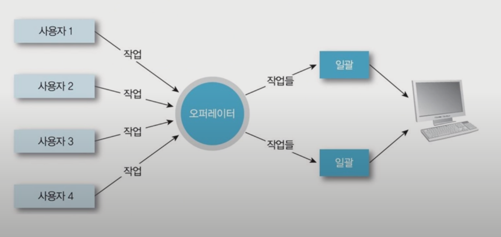
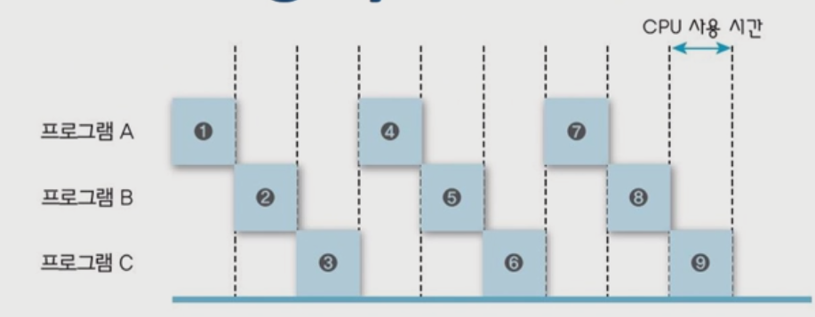
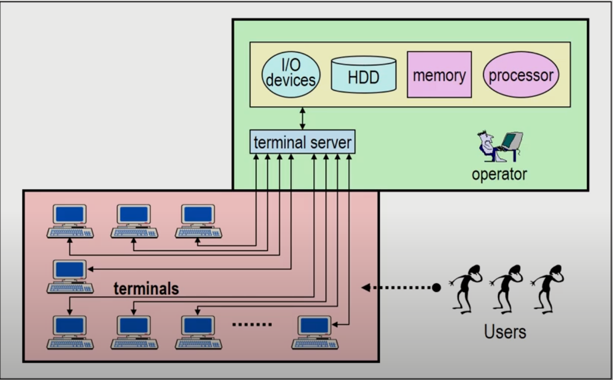
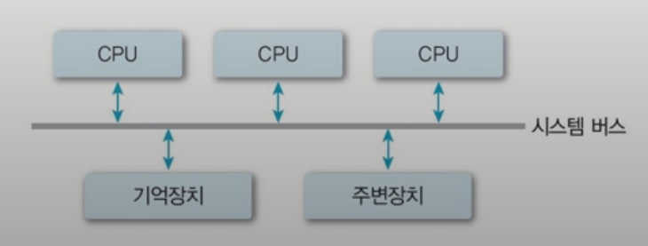
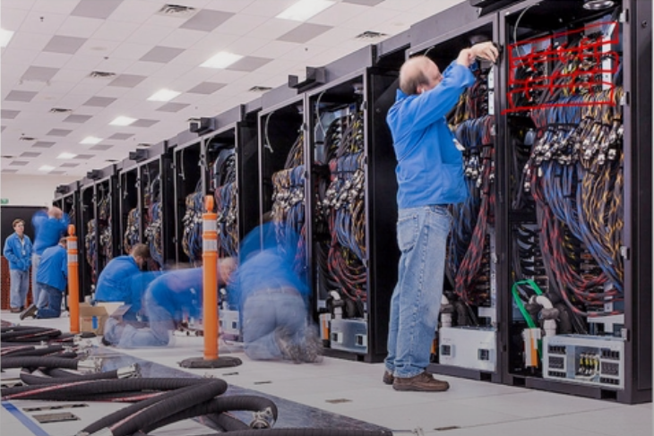
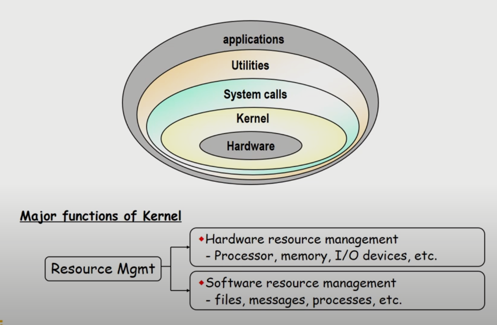
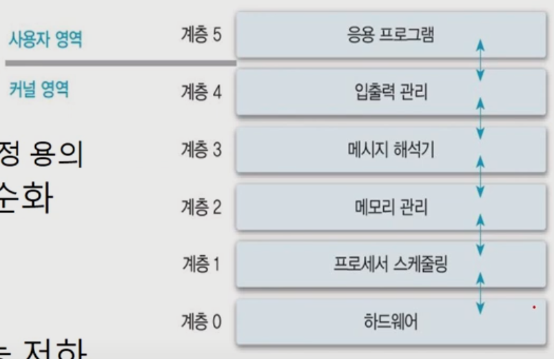
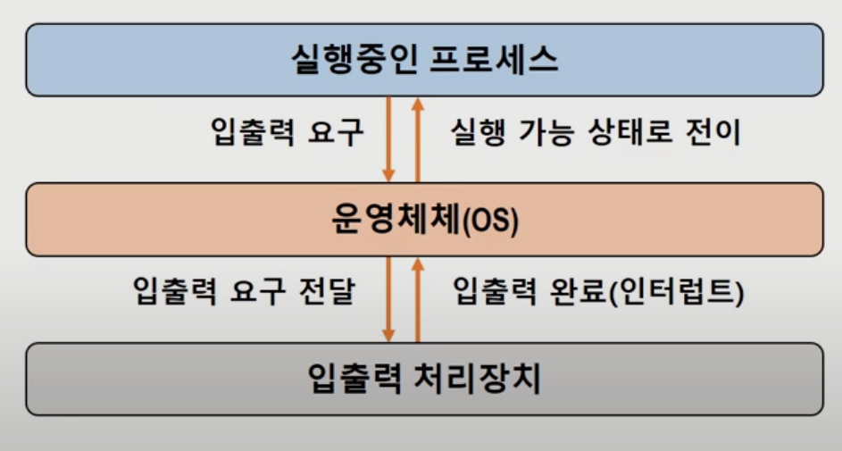

# 운영체제의 역할
## User Interface (편리성)
* CUI (Character user interface)
* GUI (Graphical user interface)
* EUCI (End-User comfortable interface)
  * 특정 목적많을 위해 특화된 UI ex) mp3 UI

## Resource management (효율성)
* HW resource (processor, memory, I/O devices, Etc.)
* SW resource (file, application, message, signal, Etc.)

## Process and Thread management
## System management (시스템 보호)

***

# 컴퓨터 시스템의 구성
* Kernel: 운영체제의 핵심
* System Call Interface: 커널이 제공하는 기능 중 사용자가 사용할수 있는 기능들 or 사용자가 커널에 바로 접근하는것을 막고 허용된 접근만 허용하는 통로
  * 보통 함수 형태로 제공 된다.
  * 시스템 라이브러리 = System Call Interface

***

# 운영체제의 구분
## 동시 사용자 (Single-user system)
* 한 명의 사용자만 시스템 사용 가능
  * 한 명의 사용자가 모든 시스템 자원 독점
  * 자원관리 및 시스템 보호 방식이 간단 함
* 개인용 장비 (PC, mobile) 등에 사용
  * Windows, android, MS_DOS 등

## 다중 사용자 (Multi-user system)
* 동시에 여러 사용자들이 시스템 사용
  * 각종 시스템 자원(파일 등)들에 대한 소유 권한 관리 필요
  * 기본적으로 Multi-tasking 기능 필요
  * os의 기능 및 구조가 복잡
* 서버, 클러스터(cluster)장비 등에 사용
  * 호스트들이 연결된 서버 컴퓨터 시스템
  * Unix, Linux, Windows server 등

## 동시 실행 프로세스 수
* 단일 작업 (Single-tasking system)
  * 시스템 내에 하나의 작업(프로세스)만 존재
    * 하나의 프로그램 실행을 마친 뒤에 다른 프로그램의 실행
  * 운영체제의 구조가 간단
  * 예) MS-DOS

* 다중 작업 (Multi-tasking system)
  * 동시에 여러 작업(프로세스)의 수행 가능
    * 작업들 사이의 동시 수행, 동기화 등을 관리해아 함
  * 운영체제의 기능 및 구조가 복잡
  * 예) Unix/Linux, Windows 등

## 작업 수행 방식
### 순차 처리 (~ 1940s)
* 운영체제 개념이 존재하지 않았을 시절
  * 사용자가 기계어로 직접 프로그램 작성
  * 컴퓨터에 필요한 모든 작업 프로그램에 포함
    * 명령어 저장 방법, 계산 대상, 결과 저장 위치와 방법, 출력 시점, 위치 등
* 실행하는 작업 별 순차 처리 필요
  * 각각의 작업을 하기 전 준비시간이 서요 된다. // 1번 프로그램 준비 → 1번 프로그램 실행 → 2번 프로그램 준비 → 2번 플로그램 실행 → 준비...

### Batch System (1950s ~ 1960s)
* 모든 시스템을 중앙(전자 계산소 등) 에서 관리 및 운영
* 사용자의 요청 작업(천공 카드 등)을 일정시간 모아 두었다가 한번에 처리
  * 1번 프로그램에 대한 유형을 100개정도 모아두었다 한번에 일괄 처리
#### 장점
  * 많은 사용자가 시스템 자원 공유
  * 처리 효율 (throughput) 향상
#### 단점
  * 생산성 (productivity) 저하
    * 같은 유형의 작업들이 모이기를 기다려야 한다.
  * 긴 응답시간 (turnaround time)
    * 작업 제출에서 결과 출력까지의 시간이 약 6시간 걸린다고 한다.
* 시스템 지향적 (Ststem-oriented) 이다.

### Time Sharing System (1960s ~ 1970s)
* 여러 사용자가 자원을 동시에 사용
  * 이 시기부터 파일 시스템 및 가상 메모리 관리 라는 개념이 생겼다.
* 사용자 지향석 (User-oriented)
  * 대화형 (conversational, interactive) 시스템
  * 단말기 (CRT terminal) 사용
    * 단말기에 HW가 있는것은 아니고 메인 컴퓨터에 접속해서 입력과 출력을 도와주는 역할을 한다.
#### 장점
* 응답시간 (response time) 단축 (약 5초)
* 생산성 (productivity) 향상
  * CPU 활용률 (utilization)이 증가

#### 단점
* 통신 비용 증가
* 이 시기부터 보안문제가 생겼다
* 개인 사용자 체감 속도 저하
  * 사용자 수가 많아지면서 시스템 부하가 돼고 개인이 체감하는 속도가 느려진 경향이 있다.

### Personal Computing
* 개인이 시스템 전체 독점
* CPU 활용률 (utilization)이 고려의 대상이 아님
  * 일반적인 사용자가 얼마나 편하게 시스템을 사용하느냐가 더 중요한 고려 요소
  * 일반적인 윈도우의 CPU 사용량 생각
* OS가 상대적으로 단순함
  * 하지만, 다양한 사용자 지원 기능 지원

#### 자원
* 빠른 응답 시간
#### 단점
* 성능 (performance)이 낮음
  * 개인이 비싼 시스템을 이용하긴 어렵기 떄문에

### Parallel Processing System
* 단일 시스템 내에서 둘 이상의 프로세서 사용
  * 동시에 둘 이상의 프로세스 지원
  * 일반적으로 서버용으로 사용
  * 일반적인 환경에서 비슷하게 만든것이 멀티코어 CPU
* 메모리 등의 자원 공유 (Tightly-coupled system)
* 사용 목적
  * 성능 향상
  * 신뢰성 향상 (하나가 고장나도 정상 동작 가능)
* 프로세서 간 관계 및 역할 관리가 필요하다.

### Distributed Processing System
* 네트워크를 기반으로 구축된 병렬처리 시스템 (Loosely-coupled system)
  * 물리적인 분산, 통신망 이용한 상호 연결
    * 아래 그림은 빨간 네모 한칸이 컴퓨터이고 해당 컴퓨터들을 물리적으로 선으로 연결을 한 형태다
  * 각각 운영체제 탑재한 다수의 범용 시스템으로 구성
  * 사용자는 **분산운영체제**를 통해 하나의 프로그램, 자원처럼 사용 가능 (은폐성, transparency)
  * 각 구성 요소들 간의 독립성 유지, 공동 작업 가능
  * Cluster system, client-server system, P2P 등

#### 자원
* 자원 공유를 통한 높은 성능
* 고신뢰성, 높은 확장성

#### 단점
* 구축 및 관리가 어렵다.

### Real-time System (다른 관점으로 보는 System)
* 작업 처리에 제한 시간 (deadline)을 갖는 시스템
  * 제한 시간 내에 서비스를 제공하는것이 자원 활용 효율보다 중요한 겨우
* 작업의 종류
  * Hard real-time task
    * 시간 제약을 지키지 못하는 경우 시스템에 치명적 영향 // ex) 원자력 발전소 제어, 무기 제어 등
  * Soft real-time task
    * 큰 문제를 일이키지 않는 경우 // ex) 1초에 30장의 그림을 그려야 하는 동영상 서비스
  * Non real-time task

***

# OS의 구조
## 커널 (Kernel)
* OS의 핵심 부분 (메모리 상주)
  * 가장 빈번하게 사용되는 기능들을 담당 // ex) 시스템 관리 (processor, memory, Etc) 등
* 동의어 (Kernel의 본 뜻은 "알맹이" 다)
  * 핵(neucleus), 관리자(supervisor) 프로그램, 상주 프로그램(resident program), 제어 프로그램(control program) 등

## 유틸리티 (Utility)
* 커널을 제외한 부분
* 비상주 프로그램
* UI등 서비스 프로그램

## 단일 구조
* OS의 기능을 한 커널에 몰아넣은 구조

#### 장점
* 커널 내 모듈간 직접 통신
  * 효율적 자원 관리 및 사용

#### 단점
* 커널의 거대화
  * 오류 및 버그, 추가 기능 구현 등 유지보수가 어려움
  * 동일 메로리에 모든 기능이 있어, 한 모듈의 문제가 전체 시스템에 영향 // ex) 악성코드 등

## 계층 구조
* 한번에 몰아넣는것이 아닌 기능별로 그리고 계층적으로 설계한 구조

#### 장점
* 모듈화
  * 계층간 검증 및 수정 용의
* 설계 및 구현의 단순화

#### 단점
* 단일 구조 대비 성능 저하
  * 원하는 기능 구행을 위해 여러 계층을 거쳐야 한다.

## 마이크로 커널 구조

* 커널의 크기 최소화
  * 필수 기능만 포함
  * 기타 기능은 사용자 영역에서 수행
  * 커널의 기능은 정의하기 나름이다.

***

# 운영체제의 기능
## Process Management
* 프로세스 (Process)
  * 커널에 등록된 실행 단위 (실행 중인 프로그램)
  * 사용자의 요청을 수행하고 프로그램 기능을 수행하는 주체(entity)
* OS의 프로세스 관리 기능
  * 생성 / 삭제, 상태 관리
  * 자원 할당
  * 프로세스 간 통신 및 동기화 (synchronization)
  * 교착상태 (deadlock) 해결
* 프로세스 정보 관리
  * PCB (Process Control Bloc)

## Processor Management
* 프로그램을 실행하는 핵심 자원인 Processor를 관리하는것도 OS의 역할이다.
* 프로세스 스케줄링 (Scheduling)
  * 시스템 내의 프로세스 처리 순서 결정
* 프로세서 할당 관리
  * 프로세스들에 대한 프로세서 할당
    * 한번에 하나의 프로세스만 사용 가능

## Memory Management
* Memory를(일반적으로 주기억장치) 관리하는것도 OS의 역할이다.
* **Multi-user, Multi-tasking 시스템**
  * 프로세스에 대한 메모리 할당 및 회수
  * 메모리 여유 공간 관리
  * 각 프로세스의 할당 메모리 영역 접근 보호
* **메모리 할당 방법 (scheme)**
  * 전체 적재
    * 장점: 구현이 간단 / 단점: 제한적 공간
  * 일부 적재 (virtual memory concept)
    * 프로그램 및 데이터의 일부만 적재
    * 장점: 메모리의 효율적 활용 / 단점: 보조기억 장치 접근 필요

## File Management
* 파일: 논리적 데이터 저장 단위
* 사용자 및 시스템의 파일 관리
* 디렉토리 (directory) 구조 지원
* 파일 관리 기능
  * 파일 및 디렉토리 생성 / 삭제
  * 파일 접근 및 조작
  * 파일을 물리적 저장 공간으로 사상 (mapping)
  * 백업 등

## I/O Management
* 입출력(I/O) 과정은 반드시 OS를 거쳐야 한다.

## 그 외 운영체제가 관리하는 자원들
* Disk
* Networking
* Security and Protection system
* Command interpreter system
* System call interface
  * 응용 프로그램과 OS 사이의 인터페이스
  * OS가 응용프로그램에 제공하는 서비스
