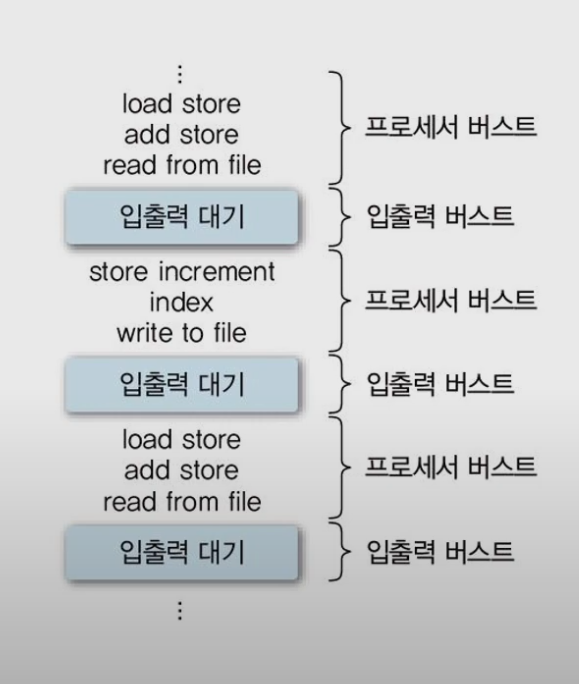

# Multi-programming
* Process Scheduling을 하는 이유
* 현재 우리가 사용하는 일반적인 컴퓨터는 여러개의 프로세스가 시스템 내 존재
    * 그러므로 자원을 나누어 사용해야한다 즉, 자원을 할당 할 프로세스를 선택 해야 한다 => 스케줄링

## 자원 관리
* 시간 분할 (time sharing) 관리
    * 하나의 자원을 여러 스레드들이 번갈아 가며 사용
    * 프로세서 사용시간을 프로세스들에게 분배 (Process Scheduling)
        * 프로세서는 한번에 하나의 프로세스만 실행 가능하기에 time sharing 방법을 이용 한다.
* 공간 분할 (space sharing) 관리
    * 하나의 자원을 분할하여 동시에 사용
    * 대표적으로 memory 가 존재

# 스케줄링의 목적
* 시스템의 성능(performance) 향상
* 대표적 시스템 성능 지표 (index) => 모호한 성능이란 개념을 정의한 것
    * 응답 시간 (response time)
        * 하나의 프로그램이 컴퓨터에 적재된 후 수행이 시작되어 첫 번째로 사용자에게 응답을 줄 때까지의 시간을 의미한다.
    * 작업 처리량 (throughput)
        * 임의의 단위시간당 처리된 프로세스들의 개수를 의미한다.
    * 자원 활용도 (resource utilization)
        * 주어진 시간 (Tc) 동안 자원이 활용된 시간 (Tr) => Utilization = Tr / Tc (최대 1)
    * 공평성
    * 실행 대기 방지
        * 무기한 대기 방지
    * 예측 가능성 (predictability)
        * 적절한 시간안에 응답을 보장하는가
    * 그 이외 엄청 많다.
* 어떤 지표가 가장 중요할까?
    * 목적에 맞는 지표를 고려하여 기법을 선택해야 한다.
        * Realtime System, interactive system(대화형 시스템) => Response time
        * Batch System => 작업 처리량
        * 비싼 시스템 => 자원 활용도

# 대기시간, 응답시간, 반환시간

* 대기시간: 도착 ~ 실행시간
* 응답시간: 도착 ~ 첫번째 출력 (쉽게말해 화면에 무엇이 나오는 시간)
* 반환시간: 도착 ~ 원하는 일이 모두 끝날때까지의 시간
* 실행시간: 반환시간 - 대기시간

# 스케줄링 기준 (Criteria)
* 스케줄링 기법이 고려하는 항목들
    * 프로세스의 특성
        * I/O-bounded or compute-bounded
    * 시스템 특성 or 목적
        * Batch system or interactive system
    * 프로세스의 긴급성 (urgency)
        * Hard or soft or realtime or non-real time system
    * 프로세스 우선순위 (priority)
    * 프로세스 총 실행 시간 (total service time)

## CPU burst vs I/O burst
* 우리의 컴퓨터는 CPU 사용과 I/O 사용 or 대기 가 반복하면서 돌아가게 되어 있다.
* CPU burst => cpu 사용 시간
    * if (CPU burst > I/Oburst) => compute-bounded
* I/O burst => I/O 대기 시간
    * if (CPU burst < I/Oburst) => I/O-bounded
* Burst time, CPU, I/O중 어느 부분에 시간을 많이 쓰는지는 스케줄링의 중요한 기준중 하나다.

# 스케줄링의 단계 (Level)
* 발생하는 빈도 및 할당 자원에 따른 구분
## Long-term Scheduling
* 가끔 일어나는 스케줄링
### Job scheduling, Job -> Created State
* 시스템에 제출 할(kernel에 등록 할) 작업(Job) 결정
* 다중 프로그래밍 정도(defree) 조절
    * 시스템 내에 프로세스 수 조절
* I/O-bounded 와 compute-bounded 프로세스들을 잘 섞어서 선택해야 한다.
    * 그냥.. 너무 한쪽만 쓰면 다른 한쪽을 못쓰니까.. // Todo

**특이사항:** 시분할 시스템에서는 모든 작업을 시스템에 등록하기 때문에 Long-term scheduling이 불필요 하다, 물론 완전 불필요 하진 않기에 덜 중요하다 라고 생각해도 됀다.

## Mid-term scheduling
* 종종 일어나는 스케줄링
### 메모리 할당 결정 (memory allocation), Suspended ready State -> Ready State
* intermediate-level scheduling
* Swapping (swap-in/swap-out)

## Short-term scheduling
* 자주 일어나는 스케줄링
### Process scheduling, Ready State -> running State
* Low-level scheduling
* 프로세서(processor)를 할당할 프로세스(process)를 결정 (dispatch)
* 가장 빈번하게 발생한다.
    * Interrupt, block (I/O), time-out, Etc.
    * 매우 빨라야 한다.
        * example) average CPU burst(100ms) + scheduling decision(10ms) = 110ms, 10 * (100 + 10) = 9%, 즉 9%의 오버헤드 발생

# Schduling Policy
* 스케줄링 정책 or 방법이라 해석
## 선점 vs 비선점 (Preemptive vs Non-Preemptive scheduling)
* **선점:** 누가 와서 내것을 빼앗을수 있다.
* **비선점:** 누가 내것을 빼았을수 없다.

### Non-Preemptive scheduling
* 어떤 Process가 자원을 할당받으면 스스로 해당 자원을 반납 할때까지 계속 사용한다.
    * 예) System call, I/O 등 // Todo, 한 OS에 프로세스마다 정책을 다르게 하나?
    * **장점:** Context switch overhead가 적다
    * **단점:** 잦은 우선순위 역전(우선순위가 높은데도 바로 하지 못할수 있는것), 평균 응답 시간 증가

### Preemptive scheduling
* 타의에 의해 자원을 빼앗길수 있다.
    * 예) 할당 시간 종료, 우선순위가 높은 프로세스 등장
* Context switch overhead 가 크다.
* Time-sharing system, real-time system 등에 적합

# Priority
* 프로세스의 우선순위
### Static priority (정적 우선순위)
* 프로세스 생성시 결정된 priority가 유지 됨
* 구현이 쉽고, overhead가 적음
* 시스템 환경 변화에 대한 대응이 어려움

### Dynamic priority (동적 우선순위)
* 프로세스의 상태 변화에 따라 priority 변경
* 구현이 복잡, priority 재계산 필요 -> overhead가 큼
* 시스템 환경 변화에 유연한 대응 가능

