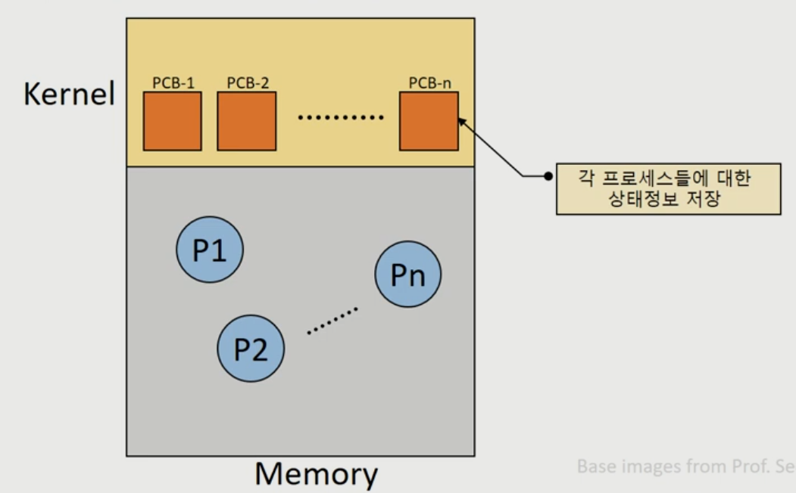

# Process or Job vs Program
* 이들중 하나씩 제대로 알면 된다.
## Program or Job
* 프로그래머가 C, C++, JAVA 같은 언어로 작성한 텍스트 파일들
    * 해당 파일들은 디스크에 보관되어 있는 상태
    * 컴퓨터 시스템에 실행 요청 전의 상태
* 프로그래머가 만든 프로그램들 뿐만 아니라, 운영체제가 컴퓨터 운영에 필요하여 만든 프로그램들도 포함하고 이들을 시스템 프로그램이라 명칭한다.
    * 해당 시스템 프로그램은 특별한 권한(privilege)를 부여받게 되지만, 일반 프로그램과 똑같이 운영체제 내부에서는 하나의 프로세스 구조체로서 간주되며 수행이 통제되게 된다.
        * ex) init, getty, login, swapper...


### Process
* 프로그래머가 만든 프로그램이 Processer에 의하여 수행되는 상태, 즉 활성화 되어 동작하는 상태
* 실행을 위해 시스템(커널)에 등록된 Job or Program
    * 시스템 성능 향상을 위해 커널에 의해 관리 된다.
* 프로세스 관리 블록(PCB)을 할당받은 개체
* 실행 중에 각종 자원을 요구, 할당, 반납하며 진행하는 능동적인 개체(active entity)

* Youtube only
#### 프로세스의 종류
|구분|종류|설명|
|--|--|--|
|역할|시스템(커널) 프로세스|모든 시스템 메모리와 프로세서의 명령에 액세스 할 수 있는 프로세스, 프로세스 실행 순서를 제어하거나 다른 사용자 및 커널(운영체제) 영역을 침범하지 못하게 감시하고, 사용자 프로세스를 생성하는 기능을 한다.|
|역할|사용자 프로세스|사용자 코드를 수행하는 프로세스|
병행 수행 방법|독립 프로세스|다른 프로세스에 영향을 주지 않거나 다른 프로세스의 영향을 받지 않으면서 수행하는 병행 프로세스 이다.|
병행 수행 방법|협력 프로세스|다른 프로세스에 영향을 주거나 다른 프로세스에서 영향을 받는 병행 프로세스이다.|

***

* Youtube only
# 자원(Resource)의 개념
* 커널에 관리 하에 프로세스에게 할당/반납 되는 수동적 개체(passive entity)
## 자원의 분류
### H/W resources
* Processor, memory, disk, monitor, keyboard, Etc.
### S/W resources
* Message, signal, files, installed SWs, Etc.

***

* TODO: if PCB == Process structure ?
# Process structure, PCB
* OS는 Process 생성시 Process 대한 정보를 한곳에 모아 구조체(struct proc {.....})를 생성하여
Process를 관리하고 이를 PCB(process control block) 하고 지칭한다.
* OS는 이 PCB를 기반으로 프로세스가 생성하여 종료될 때까지
Process 생애를 관리한다.

## PCB가 관리하는 정보
* **Process ID:** Process 고유 식별 번호
* **스케줄링 정보:** 프로세스 우선순위 등과 같은 스케줄링 관련 정보들
* **프로세스 상태:** 자원 할당, 요청 정보 등
* **메모리 관리 정보:** Page table, segment table 등
* **입출력 상태 정보:** 할당 받은 입출력 장치, 파일 등에 대한 정보 등
* **문맥 저장 영역(context save area):** 프로세스의 레지스터 상태를 저장하는 공간 등
* **계정 정보:** 자원 사용 시간 등을 관리

* OS 마다 차이는 있지만 공통적인 항목들도 있다.
    * Process ID, name, Parent Process 정보, 자식 프로세스 정보, 사용 메모리 정보...




***


## 프로세스 구조와 동작

## 프로세스의 생성
* 생성된 프로세스는 독립적인
단위로 운영체제 안에 위치하며 자신이 맡은 일을 수행하기 위하여 운영체제 스케줄링 정책에
따라 CPU 자원을 차지하기 위하여 경쟁하게 된다.
* 프로그래밍 모델링 관점으로 본다면,
컴퓨터에서 동작되는 대부분의 일들은 다수 프로세스들이 협동하여 공동으로 일을 수행하는 분산
처리 모델(distributed processing model)이라고 할 수 있다. 이런 일 처리 방식을 구현하기
위하여 프로세스는 자식 프로세스들을 생성시키고 수행하여야 할 일들을 자식들에게 분산시키는
과정을 필요로 하게 된다.

```C
main(int argc, char *argv) {
    int state = 0;

    if (fork() == 0) { // 자식 프로세스
        execl("/bin/explore.exe", 0); // explore 실행
        exit(0);
    }
    else {
        printf("i am waiting\n");
        wait(&state);
    }
}
```


## 프로세스 사이의 통신
* 생성된 프로세스들은 운영체제 내부에서는 독립적 수행 주체로 자리 매김 된다. 이렇게 독립적으로 동작 되는 프로세스들 사이에 협동이
필요한 일을 해야 한다든지, 다른 프로세스와 정보 교환이 필요한 경우, 등등 프로세스들
사이에는 통신이 필요하다.
* 프로세스들 사이의 통신을 지원하는 몇몇 방식들을
지원한다. 이들 방식들을 프로세스간 통신인 IPC( Inter-Process Communication) 라고 부른다.

### 메세지 전송 (message passing)
* 장점
    1. 모든 메시지에 대한 송신과 수신은 운영체제를 통하여 이루어지므로 병행 프로세스들 사이에서 발생되는 동기화 문제를 프로그래머는 신경 쓰지 않아도 된다.
* 단점
    1. 동일한 메시지 내용이 송신자 프로세스, 수신자 프로세스, 운영체제의 공간에 존재하게 되므로 메모리 공간 낭비가 생긴다.

#### <span style="color: red">메세지 큐</span>
* PCB나 프로세스 자체와는 완전히 다른 유형의 구조
    * 정의: 프로세스 간 통신(IPC)을 위해 사용되는 커널 관리의 데이터 구조로
* 일반적으로 커널 공간게 할당된다.
    * 보안과 격리: 커널 공간은 사용자 공간보다 더 높은 보안 수준을 가지고 있습니다.
    * 데이터 무결성: 커널은 메시지 큐에 대한 접근과 조작을 제어함으로써, 프로세스 간에 안정적이고 일관된 데이터 전달을 보장합니다.
    * 효율적인 자원 관리: 커널은 시스템의 모든 자원을 관리하는 중심적 역할을 하며, 메모리 및 프로세스 관리를 통합적으로 수행할 수 있습니다.

### 공유 메모리 (shared memory)
* 커널 공간이 아닌 사용자 공간에 공유 메모리를 설정하여 다수의 프로세스들이 접근이 가능하게 한다.
* 공유 메모리를 배정받는 것은 운영체제를 통해서만 가능하다.

* 장점
    1. 같은 정보들이 사용자들 공간, 운영체제
공간에 다수 복사되는 부담은 없다.
    2. 메시지 전송은 한번에 전송할 데이터의 크기가
제한되지만, 공유 메모리 방식은 공유 메모리 공간을 대형으로 확보하므로 한번에 많은
데이터들을 처리할 수 있다.

* 단점
    1. 공유 메모리에 저장된 정보들에 대한 접근할 때 발생되는
상호 배제, 동기화 문제는 프로그래머에게 책임을 지우는 부담을 가지고 있다.

### 파이프 (pipe)
* 운영체제에서 실제 구현되는 파이프는 파일 시스템 내의 파일로서 존재한다. 물론, 특수
파일로서 운영체제가 이것을 관리하여 프로세스들 사이의 데이터 교환을 책임진다.

* 장점
    1.  프로세스들 사이의 데이터 공유는 데이터의 일관성 문제를 유지해야 하는
부담을 발생한다. 파이프 방식은 이런 부담을 운영체제가 맡아서 처리하므로 프로그래머
입장에서는 사용하기 용이한 방식이다.

### 우편함 (mailbox) / 포트 (Port)
* 해당 방식은 간접적으로 프로세스들 사이에 데이터를 주고 받는 기능을 제공한다.
* 각각의 우편함은 고유의 번호를 가지고 있다.
* 우편함은 임의의 프로세스에 의하여 생성될 수 있고, 운영체제에 의하여 생성될 수도 있다.
    * 일반적으로 프로세스에 의해 생성된 우편함은 흐로세스가 종료되면 같이 사라지게 된다.
    * 운영체제가 생성한 우편함은 컴퓨터가 동작 되는 동안 계속 유지 하게 된다.


### 소켓 (socket)
* 소켓은 네트워크를 통하여 입출력을 하기 위해 제안된 사용자 인터페이스이고 운영체제에
서는 하나의 특별 파일로 관리된다.
* 프로그래머는 소켓을 통하여 프로세스들 사이의 통신을 할
수 있다.
* 소켓은 주소(address)와 포트(port) 번호가 있다.
* 통신을 하기 위해서는 서버와 클라이언트로 임무가 나누어 지는데 소켓은 서버 쪽과 클라이언트 쪽 양쪽에 존재하게 된다. 일반적으로는 통신을 위해 서버쪽 프로세스에서 먼저 준비를 하고, 클라이언트 쪽 프로세스가 접속을 하는 방식으로 연결이 이루어진다.

## IPC의 구현
* 프로세스들 사이의
통신에서 주의해야 할 것은 공유 데이터에 대한 읽기/쓰기 연산이다.
* 임계 영역에 대한 처리를 운영체제에 맡기고 사용자 프로세스는 자신의 프로그램에만 신경을 쓰게 하는 방식인 메시지 전송, 파이프 호출 같은 접근 방식이 있다.
* 반면 공유 메모리를 사용하는 경우 성능 측면에서는 메시지 전송, 파이프 같은 방식들보다 뛰어나지만 임계 영역에 대한 처리를 사용자가 반듯이 고려하여야 하는 부담이 존재한다. 세마포어 같은 운영체제의 다른 기능들을 사용하여 임게 구역을 통제해야 한다.

### 파이프 (Pipe)
* 컴퓨터에서 거론하는 파이프는 일종의 파일을 의미한다.
* 파이프는 파일로 형성되며 데이터의 흐름은 단 방향이고 데이터에 대한 입력과 출력은 선입선출(FIFO) 의 방식을 따른다. 만약 프로세스 2개가 쌍방향으로 데이터를 주고 받으려면 2개의 파이프 파일을 설정해야 한다.
* 파이프는 프로세스들이 공유하는 자원이므로 이것에 대한 접근은 동기화(synchronization)가 보장되어야 데이터에 대한 일관성이 보장된다.
    * 한번에 하나의 프로세스만이 파이프를 통해 데이터를 읽거나 쓸 수 있도록 해야 한다는 의미

#### 이름없는 파이프를 생성하고 부모 자식같의 데이터 주고받기 예시
```C
int main() {
    int p[2], popen_pid; // 'p'는 파이프의 파일 디스크립터를 저장하는 배열, 'popen_pid'는 fork 후 생성된 프로세스의 PID를 저장
    char buf[100]; // 데이터를 읽어들일 버퍼 선언

    if (pipe(p) < 0) return; // 파이프를 생성. 생성에 실패하면 함수 종료

    popen_pid = fork(); // 현재 프로세스를 복제하여 부모와 자식 프로세스 생성
    if (popen_pid == 0) { // 자식 프로세스의 경우
        close(p[1]); // 자식 프로세스는 파이프의 쓰기용 파일 디스크립터를 닫음

        sleep(10); // 10초 동안 대기
        read(p[0], buf, 6); // 파이프에서 6바이트를 읽어 'buf'에 저장
        printf("%s\n", buf); // 버퍼의 내용을 출력
    }
    else { // 부모 프로세스의 경우
        close(p[0]); // 부모 프로세스는 파이프의 읽기용 파일 디스크립터를 닫음
        write(p[1], "Hello", 6); // 파이프에 "Hello"라는 문자열을 쓰기 (null 문자 포함 총 6바이트)
        wait(); // 자식 프로세스가 종료될 때까지 대기
    }
}
```


