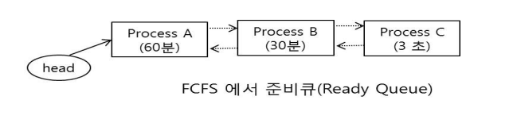

# FCFS (First-Come-First-Service)
* 선입선출 알고리즘
* Non-preemptive scheduling 사용
* 스케줄링 기준 (Criteria)
    * 도착시간, 먼저 ready queue에 도착 한 프로세스를 먼저 처리

## 장점
* 자원을 효율적으로 사용 가능, High resource utilization
    * **why:** 오는데로 프로세서에게 던져주면 돼니, 불필요한 오버해드가 굉장히 적기 때문
* Batch System에 적합, interactive system에 부적합

## 단점
* Convoy effect, 하나의 수행시간이 긴 프로세스에 의해 다른 프로세스들이 긴 대기시간을 갖게 되는 현상 (대기시간 > 실행시간)
* 긴 평균 응답시간(response time)

* 평균 반환시간(A = 3600s, B = 5400s, C = 5403s) = 4801s
* 평균 대기시간(A = 0s, B = 3600s, C = 5400s) = 3000s
* 문맥교환 = 2회 발생

***

# SJF (Shortest Job First Scheduling)
* 짧은 작업이란 수행해야 할 일이 적은 것을 의미한다, 즉 수행 시간이 적은 일들을 우선적으로 수행시키는 스케줄링 정책이다.
* 선점형, 비선점형 모두 가능
* 선점형은 이론적으로 가장 짧은 평균 대기 시간을 제공한다.

## 비선점인 경우
* 프로세스 A가 들어와 실행하는 도중 이보다 더 짧은 C가 2초후 들어왔어도 비선점이기 때문에 A 이후 C가 수행된다, 즉 A -> C -> B
* 해당 그림은 비선점형 SJB에 맞추어 프로세스들이 준비 큐에 연결된 모습이다.

* 평균 반환시간(A = 3600s, B = 3599s + 3s + 1800s, C = 3598s + 3s) = 4201s
* 평균 대기시간(A = 0s, B = 3599s + 3s, C = 3598s) = 2400s
* 문맥교환 = 안써져있고 오히려 물어봄

## 선점형 방식인 경우
* 새로 도착한 프로세스가 우선순위 조건을 만족한다면 현재 수행중인 프로세스로부터 CPU를 빼앗을 수 있는 정책
* 이론적으로 가장 짧은 평균 대기 시간을 제공한다.
### 단점
* 프로세스들의 예상되는 수행 시간을 미리 알아야 한다.
    * 이때는 지수평균(exponential average) 공식을 사용할 수 있으나 오차가 존재한다.
    * 때로는 예상시간을 수행 전에 미리 알기 불가능 할 수도 있다.
* 현재 준비 큐에 있는 프로세스들보다 짧은 수행 시간을 가진 프로세스들이 계속해서 도착하기 시작하면 기존의 프로세스는 계속 기다리는 문제, 즉 기아(Starvation)현상이 발생
    * 운영체제의 3개 목적 중 하나인 형평성에 위배된다.

1. A도착
2. A 1초간 수행
3. B 도착
4. A > B 이므로, A는 CPU를 빼았기고 B가 CPU를 할당받아 수행 -> 문맥교환++
5. C도착
6. B > C 이므로, B는 CPU를 빼았기고 C가 CPU를 할당받아 수행 -> 문맥교환++
7. C가 끝나면 B로 문맥교환++
8. B가 끝나면 A로 문맥교환++

* 평균 반환시간(A = 1s + 1s + 3s + 1799s + 3599s, B = 1s + 3s + 1799s, C = 3s) = 2403s
* 평균 대기시간(A = 1s + 3s + 1799s, B = 3s, C = 0s) = 602s
* 문맥교환 = 4회 발생

***

# RR (Round Robin)
* 프로세스들에게 수행 시간의 차이에 영향 받지 않고 공정한 CPU 활용을 제공하므로 가장 보편적으로 사용되는 스케줄링 정책이다.

***

# 우선순위 스케줄링 (Priority Scheduling)
* 프로세스들이 생성될 때 각각의 우선순위가 정해지고, 우선순위가 스케줄링에 반영되는 정책이다.
    * 예를들어, 화제 감시 및 통제, 전기 수급 통제 같은 작업을 담당한 프로세스는 매우 높은 우선순위를 부여받게 된다.
* SJF도 우선순위 스케줄링의 한 예이다.

# 마감시간 우선 스케줄링 (Deadline First Schediling)
* 마감시간이 임박한 프로세스를 우선적으로 수행 완료하는 방식
* 실시간 시스템과 같이 제한된 시간에 작업을 끝내야 하는 목표를 가진 경우 많이 사용된다.

# 다단계 큐 스케줄링 (Multiple Level Queues Scheduling)
* 이제까지 몇몇 기본적인 프로세스 스케줄링들에 대해 학습하였다, 현재 우리가 사용하는 범용 컴퓨터 운영체제에서는 이들을 혼합하여 사용하는 다단계 큐 스케줄링을 흔히 적용하고 있다.
* 이름 그대로, 준비 큐가 아나가 아닌 여러개를 사용한다는 의미를 가지고 있다.
    * 각각의 큐는 저마다의 스케줄링 정책을 가지게 되고, 큐들 사이에는 수행 우선순위를 정하므로 긴급한 처리가 필요한 프로세스들은 우선적으로 처리될 수 있게 한다.

* 그림에는 3개의 준비큐가 존재한다, 1단계 준비큐는 SJF, 2단계 준비큐는 RR, 3단계 준비큐는 FCFS
* 우선순위가 높은큐에 포함된 모든 프로세스들이 종료되어야 다음 우선순위를 가지는 준비 큐의 프로세스들이 수행될 수 있다.
* 프로세스들은 생성될 때 자신이 포함될 우선순위를 부여 받고 해당된 준비 큐에 연결 된다.
## 단점
* 높은 우선순위를 가지는 프로세스들이 연속하여 생기는 경우 낮은 우선순위를 가지는 준비큐에 있는 프로세스들은 기아 현상이 발생할 수 있다.

# 다단계 피드백 큐 스케줄링 (Multiple Level Feedback Queues Scheduling)
* 준비 큐들 사이에 프로세스들이 이동할 수 있는 방법을 제공하는 스케줄링 방법
* 앞서 설명한 기아현상을 방지하기 위한 스케줄링이다.

## 특징
* 프로세스가 생성될때 가장 높은 우선순위를 가지는 준비큐에 배치된다.
* 해당 프로세스가 배치된 준비큐의 조건 퀀텀 안에 자신의 작업을 완료하지 못하면 다음단계의 우선순위를 가지는 준비큐로 배치된다, 즉 현재 단계에서 수행을 진행한 후 완료되지 못한 경우 다음 단계의 큐로 배치되어 남은 수행을 진행하게 한것이다.
* CPU 사용시간이 긴 프로세스는 결국 시간이 흐를수록 가장 낮은 단계의 준비 큐에 배치된다.
* I/O 발생이 빈번한 프로세스의 경우 높은 우선순위 준비 큐에 계속 남아있을 경우가 있으나, 결국 가장 우선순위가 낮은 우선순위 준비큐에 내려간다, 즉, 운영체제의 목적 중 하나인 형평성에 관한 철학, 그리고 자원의 효용성에 관한 철학들이 다중 피드백 큐 스케줄링 정책에 녹아 있다고 해야 할 것이다.
* 해당 그림에서 Process1이 퀀텀 10ms인 RR정책을 수행하고 있다. Process1이 프로세서를 할당 받아 시작 후 4ms 지난 시점에 I/O를 요구한다면 이 프로세스는 CPU를 자진 반납하므로 준비큐에서는 제외되지만, I/O가 완성된 후에는 다시 1단계 준비 큐에서 자신의 차례를 기다리게 된다. 그러나 10ms 내에 작업 완료를 못한다면, 2단계 준비큐로 이동된다.
* 4단계에서는 무한대의 퀀텀을 의미하는 선입선출 정책이 정용된다.
* 4단계에 도착한 프로세스들은 1~3단계 큐에 프로세스들이 존재하지 않는다면 자신들의 일을 완료할 수 있을 것이다. 그러나 1~3단계 프로세스들의 준비큐를 차지하게 된다면 4단계 큐는 기아가 발생할 수 있다.

