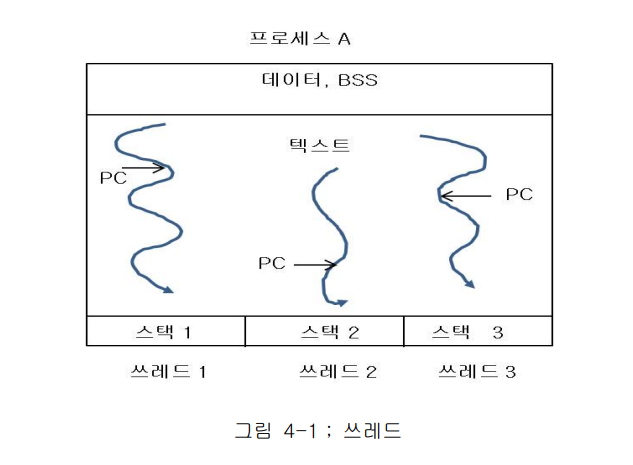

# Thread
* 이전 학습한 내용에 따르면 PCB가 크거나, 빈번만 문맥교환이 발생하거나, 빈번한 I/O가 발생하는 프로그램들은 자신에게 주어진 퀀텀 시간도 제대로 사용 못하고 CPU를 반납하게 된다.
* 이러한 형평성을 배려하기 위해 Thread Package가 사용되고 있다.

* 해당 그림을 통해 하나의 프로세스는 여러개의 쓰레드들을 사용할수 있는걸 알수 있다.
* 텍스트, 데이터, BSS는 공유하지만 스택은 각자 가지고 동작한다.
* 쓰레드는 자신의 PC(Program Counter)를 유지하고, 하나의 프로세스 공간에서 스케줄링 된다.
* 예를들어 해당 그림에선 쓰레드1이 입출력이 필요한 경우 쓰레드1은 수행이 중단되지만, 쓰레드2 or 쓰레드3이 프로세스 A가 받은 퀌텀 시간 중 나머지를 사용하여 수행하게 된다, 즉 프로세스A가 운영체제로부터 받은 퀀텀시간동안 CPU 사용을 보장 받는다.

앞에서 언급한 것처럼 동일한 프로세스 내부의 쓰레드들은 프로세스에 할당된 모든 자원들을
공유하며 서로 병행 수행을 하게 된다. 이때 공유된 자원들에 대한 병행 접근은 쓰레드들의 동작
및 결과에 영향을 미치게 된다. 특히, 공유자원에 대한 병행처리를 수행 할 때 지정된 동기화
기법(Synchronization primitive)을 사용하지 않을 경우 매번 다른 결과를 가져오는 상황을 맞게
된다.
