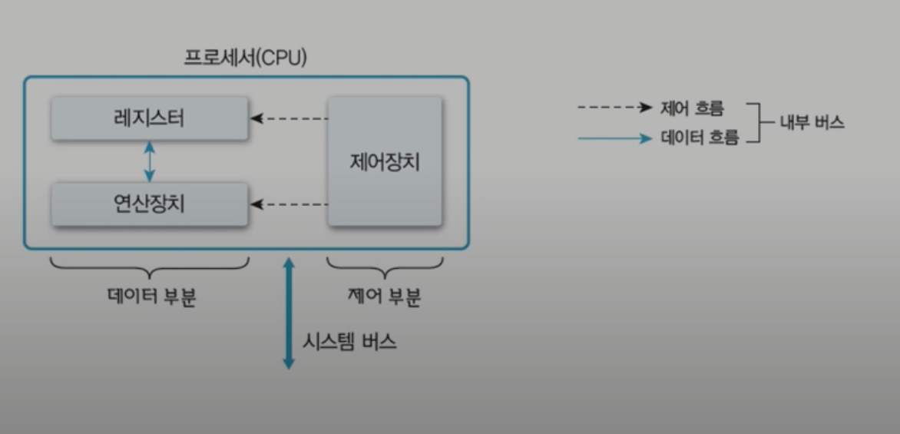
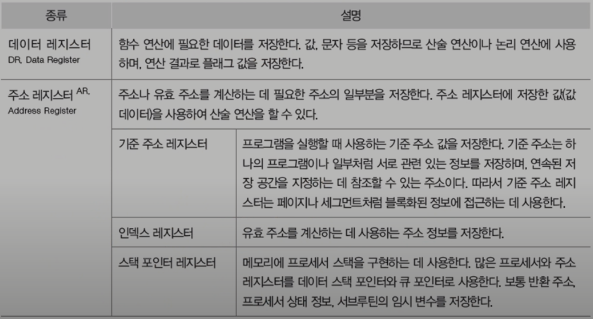
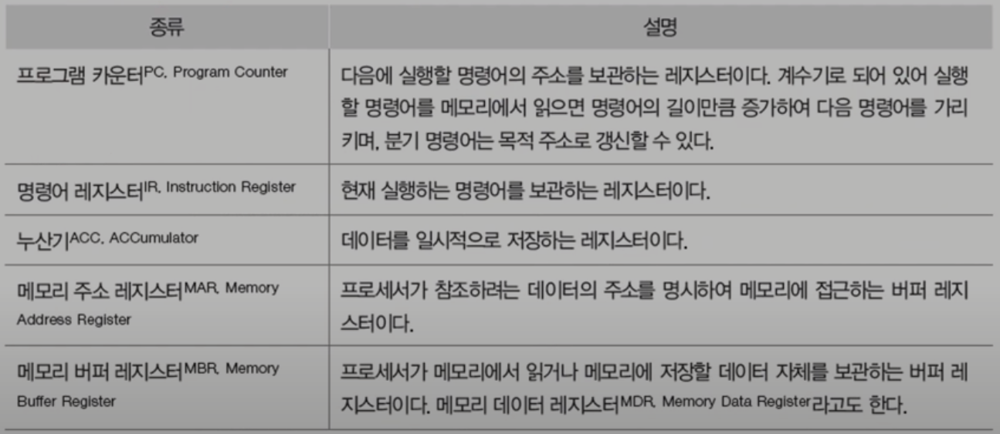
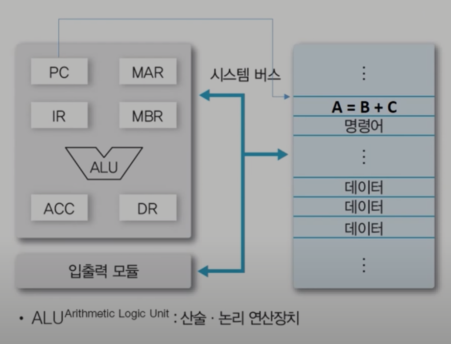
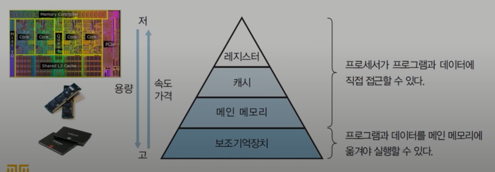
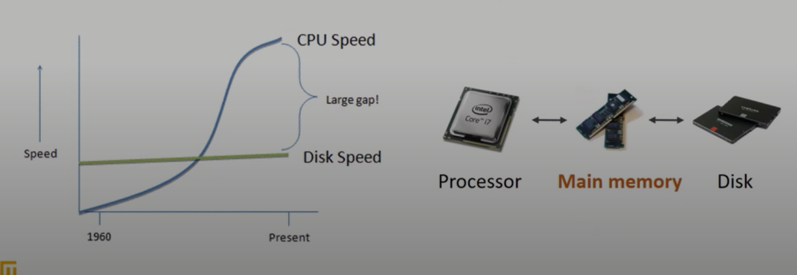
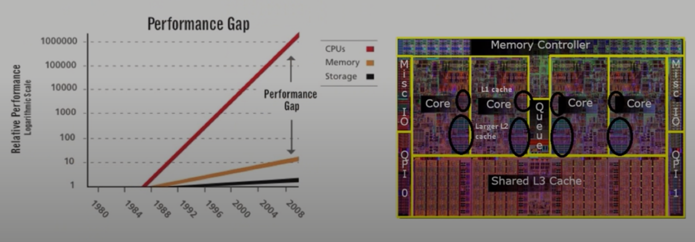
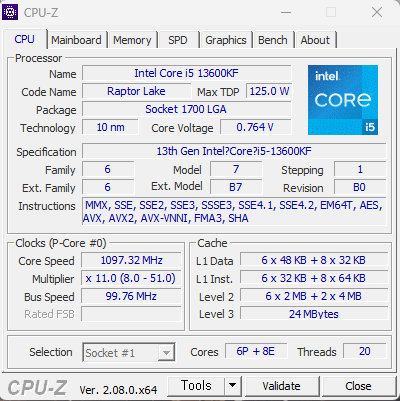
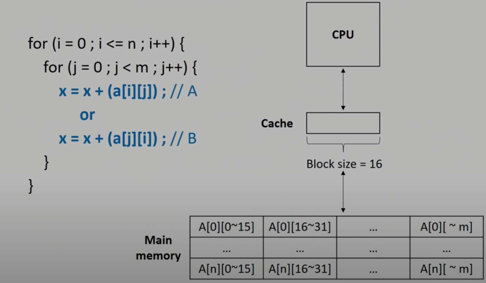

# OS
* 컴퓨터 시스템 자원 (HW) 를 효율적으로 관리하는 프로그램


***

## 컴퓨터 하드웨어
### 프로세서 (Processor)
* CPU
* GPU
* 응용 전용 처리 장치 등
  * 특별한 목적을 위해 개발된 프로세서

### 메모리 (Memory)
* 주 기억장치
* 보조 기억장치 등


### 주변장치
* 키보드 / 마우스
* 모니터, 프린터
* 네트워크 모뎀 등

***

## 프로세서 (Processor)
### 컴퓨터의 두뇌 (중앙처리장치)
* 연산 수행
* 컴퓨터의 모든 장치의 동작 제어



***

## 레지스터 (Register)
### 프로세서 내부에 있는 메모리
* 프로세서가 사용할 데이터 저장
* 컴퓨터에서 가장 빠른 메모리

### 레지스터의 종류
* 용도에 따른 분류
  * 전용 레지스터, 범용 레지스터
* 사용자가 정보 변경 가능 여부에 따른 분류
  * 사용자 가시 레지스터, 사용자 불가시 레지스터
* 저장하는 정보의 종류에 따른 분류
  * 데이터 레지스터, 주소 레지스터, 상태 레지스터

### 사용자 가시 레지스터


```C
#include <stdio.h>
#include <stdlib.h> // malloc, free 함수가 선언된 헤더 파일

int main()
{
  register int num = 10;  // 변수 num1은 CPU의 레지스터를 사용(반드시 레지스터를 사용하지는 않는다.)
  printf("%d", num);
  return 0;
}
```

### 사용자 불가시 레지스터



### 프로세서의 동작


### 운영체제와 프로세서
* 운영체제는 프로세서에게 처리할 작업 할당 및 관리하는 역할을 한다.
  * 프로세스(Process) 생성 및관리
* 프로그램의 프로세서 사용 제어
  * 프로그램의 프로세서 사용 시간 관리
  * 복수 프로그램간 사용 시간 조율 등

***

## 메모리 (Memory)
* 데이터를 저장하는 장치 (기억 장치)
  * 프로그램 (OS, 사용자SW 등), 사용자 데이터 등

### 메모리의 종류
* 보조기억장치: HDD
* 메인 메모리: DRAM
* 캐시: 레지스터 보단 멀리 떨어진 메모리



### 주기억장치 (Main memory)
* 프로세서가 수행할 프로그램과 데이터는 반드시 Main memory에 들어가 있어야 한다.
* DRAM 을 주로 사용
  * 용량이 크고, 가격이 저렴
* <span style="color: pink">디스크 입출력 병목현상(I/O bottleneck) 해서
  * disk는 CPU에 비해 너무 느리기 때문에 disk보다 빠른 Main memory를 중간에 배치하여 성능차를 매꿔주는 역할




### 캐시 (Cache)
* 프로세서 내부에 있는 메모리 (L1, L2 캐시 등)
  * 속도가 빠르고 가격이 비쌈
* <span style="color: pink">메인 메모리의 입출력 병목 현상 해소
  * Main memory를 사용함으로써 성능 향상을 이뤄냈으므로 비슷한 방법으로 성능향상을 이뤄내기 위해 사용






### 캐시의 동작
* 일반적으로 HW적으로 관리된다.
* 캐시 히트 (Cache hit)
  * 프로세서가 연산을 하기 위해 캐시에 가서 데이터를 확인할때 필요한 데이터 블록이 캐시 존재 하는 경우
* 캐시 미스 (Cache miss)
  * 프로세서가 연산을 하기 위해 캐시에 가서 데이터를 확인할때 필요한 데이터 블록이 없는 경우
    * 캐시가 메인메모리로 가서 캐시 안으로 가지고 들어온다. 그 후 가져온 데이터를 프로세서에 전달한다.


<span style="color: red">**의문점: 이렇게 작은 크기로 성능이 향상된다고? 그냥 없는게 더 좋아보이는걸?**

### 지역성 (Locality)
* 캐시가 효과를 낼수 있는 이유
  * 우리가 짜는 프로그램들은 보통 해당 지역성을 가지고 있기 때문에 결과적으로 캐시가 히트할 가능성이 높다.
* 공간적 지역성 (Spatial locality)
  * 어떤 주소를 한번 참조하면 그다음 참조하는 주소는 참조한 주소의 주변일 가능성이 높다. <span style="color: green">// ex) 순차적 프로그램 수행
  * 위 그림에선 잘 나타나있지 않지만 실제 메인메모리에서 데이터를 캐시로 가져올때는 해당 부분많이 아닌 주변까지 덩어리로 가져온다. (cache line, cache block)
* 시간적 지역성 (Temporal locality)
  * 한번 참조한 주소를 곧 다시 참조하는 특성 <span style="color: green">// ex) For문 등의 순환 문
* <span style="color: pink">지역성은 캐시 적중률(cache hit ratio)과 밀접
  * 알고리즘 성능 향상 위한 중요한 요소 중 하나


<span style="color: green">**A: 프로세서가 캐시를 확인한 후 메모리의 [0][0]번째 칸을 캐시로 가져온다. 그 후 캐시 메모리에 있는 0 ~ 15번째를 차례 대로 접근할수 있다.**
<br>
<span style="color: red">**B: 프로세서가 캐시를 확인한 후 메모리의 [0][0]번째 칸을 캐시로 가져온다. 그 다음번은 [1][0]이지만 캐시에 없기 때문에 다시 Main memory에 접근하게 된다.**

### 보조 기억 장치 (Auxiliary memory, secondary memory, storage)
* 프로그램과 데이터를 저장
* 프로세서가 직접 접근할수 없다 (프로세서는 주기억장치까지 접근 가능), 그래서 주변장치로 분류가 된다.
  * 주기억장치를 거쳐서 접근
  * (프로그램 / 데이터) > 주기억장치 인 경우?
    * 가상 메모리 (Virtual memory)
* 용량이 크고, 가격이 저렴

### 메모리와 운영체제
* 메모리 할당 및 관리
  * 프로그램의 요청에 따른 메모리 할당 및 회수
  * 할당된 메모리 관리
* 가상 메모리 관리
  * 가상메모리 생성 및 관리
  * 논리주소 → 물리조수 변환
***

## 시스템 버스 (System Bus)
* 하드웨어들이 데이터 및 신호를 주고받는 물리적인 통로


***

## 주변 장치
* 프로세서와 메모리를 제외한 하드웨어들
  * 입력장치: 키보드, 마우스
  * 출력장치: 모니터, 프린터, 스피카
  * 저장장치: Hdd, Sdd, usb

### 주변장치와 운영체제
* 장치 드라이버 관리: 어떤 하드웨어를 사용할수 있도록 제공하는 API
* 인터럽트 (interrupt) 처리: 주변 장치의 요청 처리
* 파일 및 디스크 관리: 파일 생성 및 삭제, 디스크 공간 관리 등
