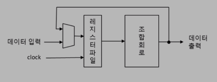
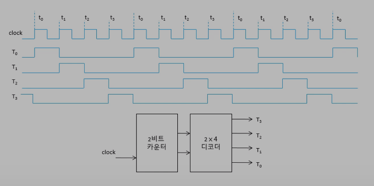

# 6.2 디지털 시스템
***

## 디지털 시스템
* 디지털 데이터를 처리하는 동기 순차 논리 회로
  * 디지털 데이터를 처리한다 라는 것은 숫자를 계산한다 라는 뜻
* 컴퓨터보다 더 큰 개념

* 명령(command): 외부에서 동작 지시
* 제어장치: 명령과 상태(조건)을 참고하여 제어신호 생성
  * 상태도 기반 동작
  * 외부의 명령어와 처리장치에서 상태신호를 받아 제어신호를 처리장치에 공급한다.
  * 타이밍 신호 발생기를 포함한다
* 처리장치: 처리할 데이터를 임시 저장하고 데이저 조작(계산)
  * 레지스터 파일과 연산기로 구성
  * 데이터 처리 담당
* 비동기 리셋: 시스템 초기화 (제어장치, 처리장치 내부 모든 레지스터에 공통으로 들어간다.)
* 시스템 클럭: 기억소자 동작 시간 제어 (제어장치, 처리장치 내부 모든 레지스터에 공통으로 들어간다.)
* 클럭과 리셋은 제어장치, 처리장치 내부의 레지스터에 공통으로 인가가 된다.
* 제어장치의 처리 순서
  1. 제어장치 외부에서 명령(세탁기를 돌려라, code 등)이 들어옴
  2. 제어장치는 처리장치에 상태 신호를 받음
  3. 두가지를 고려해 제어신호를 준다.
* 처리장치의 처리 순서
  1. 데이터를 입력받는다.
  2. 제어신호가 하라는 일을 하고 데이터를 출력, 저장 한다.(할수 있는 일이 많다.)
***
## 처리장치 구조

* 레지스터 파일: 레지스터가 여러개 모여있는것
* 사다리꼴 모양: 멀티 플렉서
  * 조합회로가 출력한 것을 저장할지, 입력받은 데이터를 저장할지 선택하는 기능을 한다.

### 마이크로 오퍼레이션
* 한개의 클럭 구간 동안 수행하는 동작(가장 기본적인 동작)

 
※ 레지스터에 적제되는 시간 + 조합회로가 계산을 하는 시간 = 지연
***
## 타이밍 신호 발생기
* 제어장치의 기능 중 하나
* 현재 몇 번째 클럭 펄스가 지나가는지 시간 구분
  * 클럭은 0과 1이 반복돼는 신호다, 딱히 구분이 없기에 타이밍 신호 발생기로 구분을 한다.
  * 그림은 클럭을 4개씩 묶었다 > 클럭 4개마다 명령어 하나를 실행 한다.
    * 명령어를 처리하기 위한 세부적인 명령어(구간)을 t0, t1, t2, t3 로 정의한다.
    * t0, t1, t2, t3 마다 1이 돼는(수행하는) 신호 > T0, T1, T2, T3

