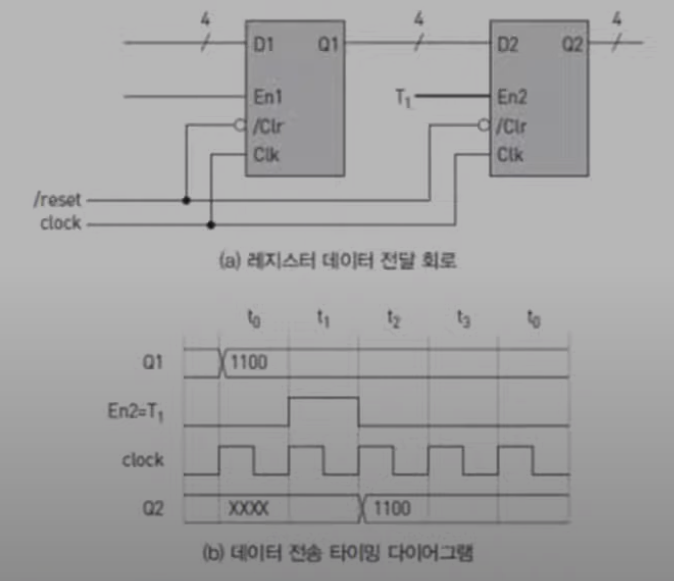
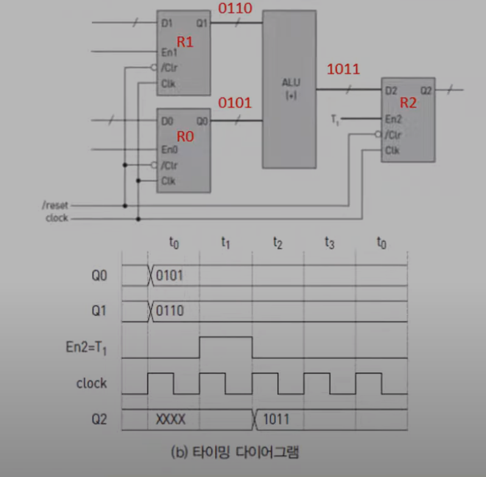
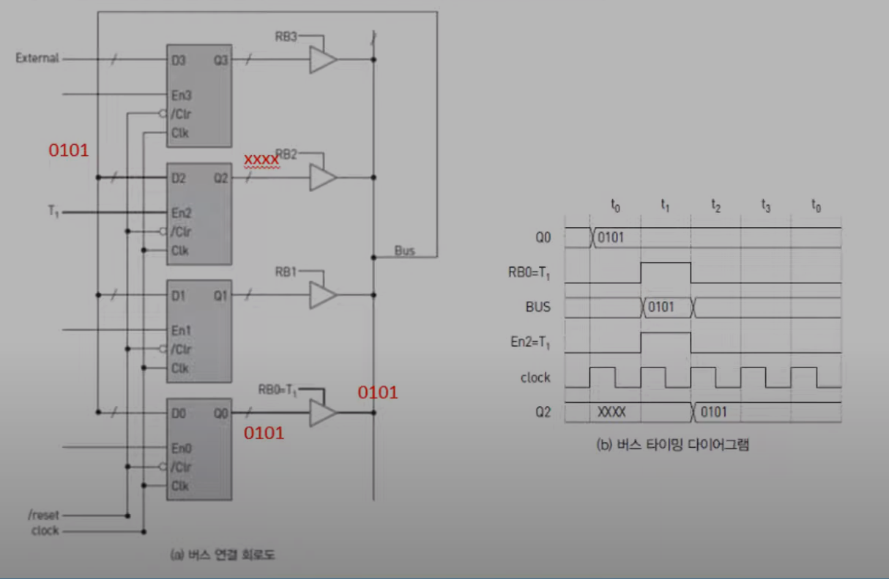
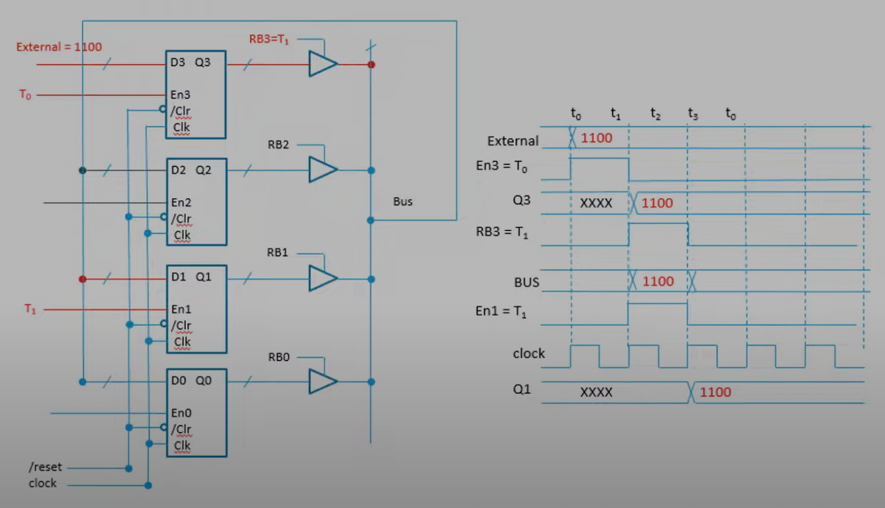

# 6.3 처리장치
* 레지스터의 데이터를 연산기에서 계산하는 일을 한다.
* 레지스터 파일과 연산기로 구성되어 있다.
* 제어장치가 제공하는 타이밍 신호를 제어신호로 받는다.

### 타이밍 신호
* 어느 레지스터를 출력할 것인지
* 어떤 연산을 수행할 것인지
* 연산 결과를 어느 레지스터에 적재할 것인지 결정한다.
***

## 레지스터 간 데이터 전송

### T1: R2 ← R1 (왼쪽 레지스터: R1, 오른쪽 레지스터: R2)
* R1의 출력을 R2의 입력으로 연결
* 제어장치의 타이밍 신호 T1을 R2의 적재기능(enable) 에 연결 했다.
  * T1 이후에 R1의 값을 R2로 전달 한다.

***

## 병렬 덧셈 T1: R2 ← R0 + R1
* R2의 enable에 제어장치의 T1이 연결되어 있다.

***

## 버스 전송 T1: R2 ← R0
* 4개의 구간 동안에 하나의 레지스터의 값을 다른 레지스터로 옮기는 동작
* 레지스터의 출력과 Bus 중간에 있는 Buffer(tri-state buffer)는 레지스터의 입력을 버스와 연결하든지 끊던지 하는 역할을 한다.
  * 그림에선 RB0만 1이고 나머진 0이다.
* T1이 enable된 R2레지스터에 Bus를 통해 0101이 전달된다.

***
## 버스 전송 (T0: R3 ← External) → (T1: R1 ← R3) 외부에서 온 신호를 다른 레지스터로 전달하는 기능
* R3는 T0가 지나면서 1100을 출력한다.
* RB3는 T1이기 때문에 T1이후 Bus를 통해 1100이 빠져나온다.
* R1에 있는 enable(T1)에 의해 R1에 1100이 적재된다. 

※ External = 시스템 외부 레지스터에서 데이터를 넣어가지고 R3에다가 적재하는것을 가능하게 하기 위해 따로 빼놓은것

***

## 버스 연산 T1: R2 ← R0 + R1
* 버스가 두개다.
  * ABus, BBus로 나누어 지고 버스에 맞게 buffer도 두개가 된다.
* R0은 ABus에 연결이 되어 있다. R1은 BBus에 연결이 되어 있다.
* ABus, BBus에 연결된 버퍼가 T1일때 0101(R0)과 0110(R1)이 전달된다.
* ALU에 의해 더해진다.
* ALU에 더해진 값이 RBus를 통해 R2에 적제가 된다.

**★ 처리장치 구조는 레지스터들, 두개의 버스, 연산기, 연산기를 통한 계산값을 다시 적재할수 있는 Bus 로 되어있다. ★**

***

## 레지스터 전송 언어

### RTL(Register Transfer Language)
* 레지스터 간 데이터 처리를 표현하는 문장
  * 언어라고 되어 있지만 프로그래밍 언어가 아니고 그냥 자유롭게 표현하면 된다.
* 하드웨어오 구현 가능해야 한다.

### 표현 방법
* 절대적인 규칙은 없고, 자유롭게 표현 가능하다.

| 기호     | 설명                                 | 예제                                           |
|--------|------------------------------------|----------------------------------------------|
| 문자(숫자) | 레지스터 이름(변수)                        | MAR, PC, R2                                  |
| 괄호     | 레지스터의 일부                           | IR[opcode], MBR[7:0]                         |
| ←      | 정보의 전달                             | R2 ← R0                                      |
| ,      | 동시 실행 마이크로 동작의 구분                  | R2 ← R0   , R3 ← R1                          |
| 콜론(:)  | 왼쪽: 동작 실행 조건 또는 기간 오른쪽: 실행할 동작 | T3: AC ← AC + MAR T1 + T2: R1 ← R2 AND R3 |

추가 설명: IR이라는 레지스터의 opcode라는 부분, MBR이라는 레지스터중 비트 0부터 7까지, T1 + T2 = T1 or T2
