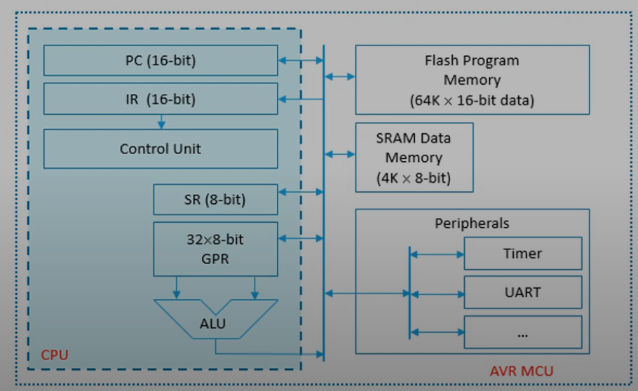

# AVR 마이크로 제어기
* 하나의 칩에 중앙처리장치, 기억장치, 주변장치를 포함한 반도체 소자
* 소형 임베디드 시스템의 제어장치로 쓰임
  * 임베디드 시스템: 범용 계산기가 아닌 기계 제어를 전용으로 하는 컴퓨터

## AVR 마이크로 제어기
* 아두이노 제어기도 AVR 마이크로 제어기다.
  * 해당 그림에선 Flash 라는 디바이스로 만들어진 Program Memory 와 SRAM 형태로 만들어진 Data Memory 각각 따로 있다. (하버드 구조)
    * Program Memory: 대략 64000개의 명령어를 저장 가능하고 방 하나의 크기는 16비트다.
    * Data Memory: 4000개 정도의 데이터가 들어갈수 있고 방 하나의 크기는 8bit다.
  * PC는 Program Memory 에 주소를 지정한다.
    * 64k 는 2^16 이기 때문에 주소선이 16비트다.
  * Program Memory 에 저장된 명령어가 16bit기 때문에 IR도 16비트다.
  * 데이터를 처리하기 위한 32개의 8bit 크기의 범용 레지스터(GPR)이 CPU 안에 있다. (데이터의 크기가 8bit기 때문에 이것도 8bit) 
* Peripherals: I/O 디바이스

