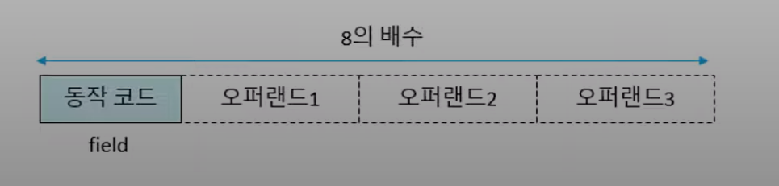
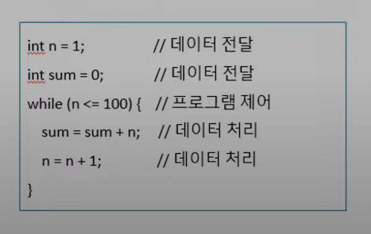

# 7.4 명령어
## 명령어 집합(instruction set)
* 프로세서가 실행할 수 있는 명령어의 모임
  * 프로세서: 제품으로 만들어진 CPU

***
## 명령어 구성 요소
### 명령어
* 하드웨어와 소프트웨어가 만나는 부분
* 컴퓨터가 수행할 일을 2진수 코드로 표현한 것

### 구성 요소
* 동작 코드(opcode, operation code): 실행할 동작
* 동작의 대상(operand): 0 ~ 3개: 동작의 대상

### 명령어 형식
* 명령어에 포함된 정보를 2진수에 배치한 형태
* 전체 길이, 필드 구성과 의미, 각 필드의 비트 수

***

## 명령어 종류
### 동작 코드에 따른 명령어의 종류
* 데이터 전달 명령어(data transfer instructions)
  * 내부 레지스터, 주기억장치, 입출력장치 간 데이터 전달(복사)
    * 현실에선 데이터를 이동시키거나 옮기면 그자리에는 없어지지만 컴퓨터는 A ← B 할시 B에도 데이터가 남아있다(복사)
* 데이터 처리 명령어(data process instructions)
  * 내부 레지스터 또는 주기억장치의 데이터를 연산기에서 조작
  * A와 B를 연산하고 다른장소인 C 라는곳에 저장하는 형태의 명령어 (C ← A * B)
* 프로그램 제어 명령어(program control instructions)
  * 프로그램 실행 순서 변경
    * ex) if, while, for, 함수
  * 명령어 자체는 이전시간에서 배웠듯이 차례대로 적재돼고 차례대로 실행이 된다.

***

## 데이터 전달 명령어
### 형태 // 전체 비트 수는 표현되어 있지 않다.
* 소스 오퍼랜드에 있는 내용을 목적지 오퍼랜드로 복사해서 옮겨라 라는 뜻

|동작 코드|목적지 오퍼랜드| 소스 오퍼랜드|
|--------|--------------|--------|

* 적재(load): Register ← Mem[address]
* 저장(store): Mem[address] ← Register
* 이동(move): {Register, Mem[address]} ← {Register, Mem[address]}
  * 팬티엄 프로세서에서 사용
  * Register ← Register, Register ← Mem[address], Mem[address] ← Register... 등 임의의 두 개의 조합을 다 할수 있는 그룹
* 입력(input): Register ← I/O Port[address]
* 출력(output): I/O Port[address] ← Register

***

## 데이터 처리 명령어
### 단항 연산 명령어
* 목적지 = op 소스
* Negate (음수, 부호 변경)
* Not, Shift, 증가, 감소

|동작 코드|목적지 오퍼랜드| 소스 오퍼랜드|
|--------|--------------|--------|

### 이항 연산 명령어
* 목적지 = 소스1 op 소스2
* 사칙 연산: +, -, *, /
* 논리 연산: AND, OR, XOR

|동작 코드|목적지 오퍼랜드| 소스 오퍼랜드1 | 소스 오퍼랜드2 |
|--------|--------------|----------|------------------|

***

## 프로그램 제어 명령어
### 프로그램 실행 순서 변경
* 궁극적으로 PC의 값 변경

### 프로그램 제어 명령어 종류
* 무조건 분기: PC ← [분기 주소]
* 조건 분기: if (조건) PC ← [분기 주소]
* 서브루틴 호출(함수 호출): 현재 PC 저장 / PC ← [서브루틴 시작 주소]
  * 프로그램이 실행되다가 함수를 만나면 함수를 실행 후 다시 돌와와야 한다.
* 서브루틴 복귀(함수 복귀): PC ← [저장된 주소]

|동작 코드| 오퍼랜드 = 분기 목적지 주소 |
|--------|------------------|

***

## 예제
1. R1 ← Mem[400]: 메모리 400에 있는 값을 레지스터 1번에 복사 = 데이터 전달
2. R2 ← R3 + Mem[401]: 레지스터 3번에 있는 값과 메모리 401에 있는 값을 더해서 레지스터 2번에 저장한다 = 데이터 처리
3. Pc ← 1004: PC에 1004에 저장한다 = 프로그램 제어
4. Mem[402] ← R2: 레지스터 2번에 있는 내용을 메모리 402에 복사한다 = 데이터 전달
5. if (ZERO) PC ← 1100: ZERO 가 조건이 맞으면 PC에 1100을 저장해라

***

# 오퍼랜드
### 오퍼랜드 (operand, 피연산자)
* 명령어가 처리하려는 동작의 대상

### 유효 데이터 (effective data)
* 중앙처리장치가 실제로 처리하는 데이터
  * R1 ← Mem[1004], 일시 실제 처리돼는 데이터는 Mem[1004] 안에 있는 값
* 크리가 정해진 2진수 현태(dP: 8 비트, 16 비트, 32 비트)

### 오퍼랜드 유형
* 즉치 데이터 (immediate data): 명령어가 유효 데이터(숫자)를 포함한다.
* 레지스터 이름: 레지스터의 값이 유효 데이터. ex) R1
* 기억장치 주소: 기억장치 해당 주소의 값이 유효 데이터. ex) M3m[1004]
* 입출력 포트: 입출력 포트의 값이 유효 데이터.

***

## 명령어 형식의 예
### R3 ← R3 + 1
|동작코드|레지스터|
|-------|------|
|INC|R3|

### R3 ← R3 + 5
* 이항연산이라 목적지 오퍼랜트가 필요하지만 해당 예에선 레지스터 부분이 소스 오퍼랜드, 목적지 오퍼랜드 두가지 역할을 하도록 설계한 예

| 동작코드 |레지스터|즉치 데이터|
|------|------|---------|
| ADD  |R3|5|

### Mem[1004] ← R1
| 동작코드  | 기억장치 주소 |레지스터|
|-------|---------|-------|
| STORE | 1004    |R1|

### R1 ← Port[1004]
| 동작코드  | 레지스터 |입출력 포트|
|-------|------|--------|
| INPUT | R1   |1004|

### R3 ← R1 + Mem[1004]
|동작코드|레지스터|레지스터|기억장치 주소|
|-------|------|----|----|
|INC|R3|R1|1004|

***

## 유효 데이터 해석
### 해석 방법
* 부호 없는 수(unsigned number)
* 정수(signed number)
* 실수(floating-point number)
* 문자 코드

### 명령어와 오퍼랜드의 관계
* 명령어에 따라 유효 데이터를 해석하는 방법이 다르다.
* 데이터의 길이, 해석 방법이 다르면 명령어의 동작 코드도 달라야 한다.
  * 같은 더하기 명령어라도 정수 + 정수, 실수 + 실수 서로 독작 코드도 달라야 한다.
