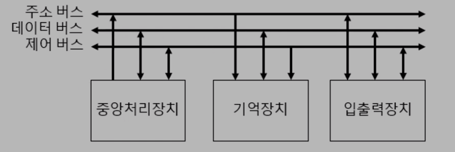
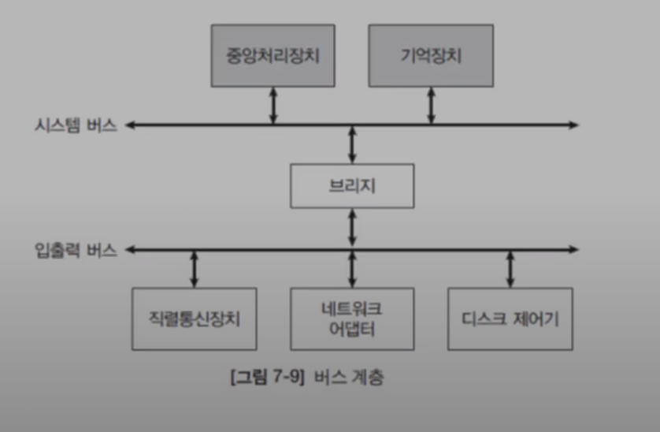

# 7.3 시스템 버스
* 컴퓨터의 세 가지 구성 요소(중앙처리장치, 주기억장치, 입출력장치)를 연결하는 신호선의 모임

***

## 시스템 버스 구성
### 주소 버스
* 기억장치 또는 입출력장치의 주소를 지정한다.
* 주소버스의 폭과 기억장치 용량은 관련이 있다.
  * 기억장치 방의 수가 2^20이면 선은 20-bit가 있어야 한다.

### 데이터 버스
* 데이터를 전달하는 경로이고, 일반적으로 8의 배수이다.
* 데이터 버스 비트 수 = 레지스터 크기 = 단어 크기

### 제어 버스
* 주소 버스와 데이터 버스를 제외한 나머지 신호.
* 각각 고유한 기능을 갖는다.

***

## 제어 신호 종류
### 기억장치 제어
* 기억장치 읽기(memory read)
* 기억장치 쓰기(memory write)

### 입출력장치 제어
* 입출력 읽기(input or I/O read)
* 입출력 쓰기(output or I/O write)
* 인터럽트 요청(interrupt request)
* 인터럼트 확인(interrupt acknowledge)
* 버스 요청(bus request)
* 버스 승인(bus grant) 

### 기타
* 시스템 클럭(system clock)
  * 컴퓨터는 결국 동기 순차 논리 회로이기 때문에 컴퓨터 외부에 클럭 발생기가 있다.
* 리셋(reset)
  * 전원키
* 전력선(power lines)
  * power supply 가 여러가지 원원을 만들어서 디바이스로 공급하고 있다.

***

## 버스 계층
* 버스 경쟁 완화
  * 버스는 신호를 한번에 한곳에서 다른곳으로 밖에 전달을 못한다. 한번에 하나의 일밖에 못하기에 버스가 하나있다면 버스가 병목이 된다.
  * 브리지 라는 장치를 둬서 버스간에 데이터를 중계 하도록 할수 있다.
* 시스템 버스: 지역 버스, 고속 버스
  * 빠른 디바이스가 붙는 버스
* 입출력 버스: 확장 버스, 저속 버스, 장치 버스
  * 느린 디바이스가 붙는 버스

