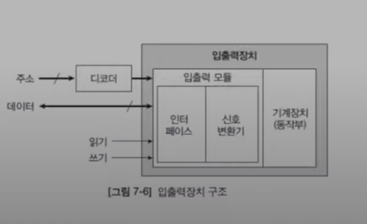

# 입출력장치
* 입력과 출력의 기준은 컴퓨터 그중 메모리다.
* 입력: 프로그램과 데이터를 공급한다.
* 출력: 컴퓨터가 처리한 데이터를 출력한다.

### 예
* 입력장치: 키보드, 마우스, 마이크, 카메라...
* 출력장치: 모니터, 프린터, 플로터, 스피커...
* 입출력장치: 보조 기억장치(디스크, usb 메모리...), 네트워크 어댑터

***

## 입출력 장치 구조
* 구조가 아주 다양해서 종류를 특정하기는 어렵다.

### 프로세서 연결
* 입출력 주소(입출력 포트)
  * 입출력 장치마다 주소가 다르기 때문에 디코더를 통해 각 장치마다 고유 주소를 할당해준다.
* 기억장치 인터페이스와 동일
  * 주소선
  * 데이터선
  * 제어선: 읽기, 쓰기

### 입출력장치 구조
* 인터페이스(interface)\
  * 컴퓨터 버스(주소선, 데이터선) 과 입출력장치를 연결해주는 역할을 한다.
  * 프로세서와 입출력장치 연결
  * 데이터 전송 속도, 데이터 형식 조정
* 신호 변환기
  * 전기신호 ↔ 기계 동작
* 동작부(actuator)
  * 기계 구동

컴퓨터 버스와 입출력 장치를 연결해주는 주소버스와 데이터 버스
프로세서 연결

