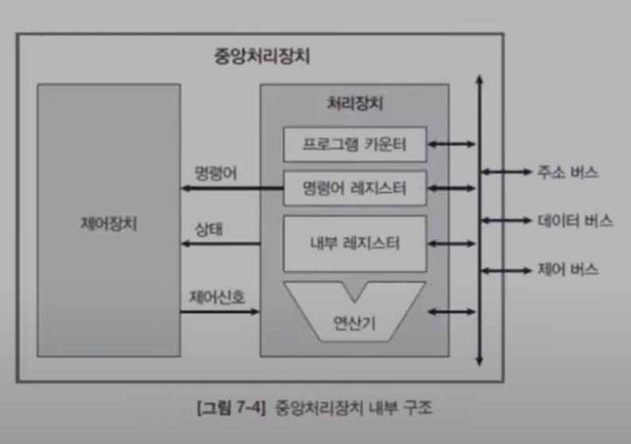
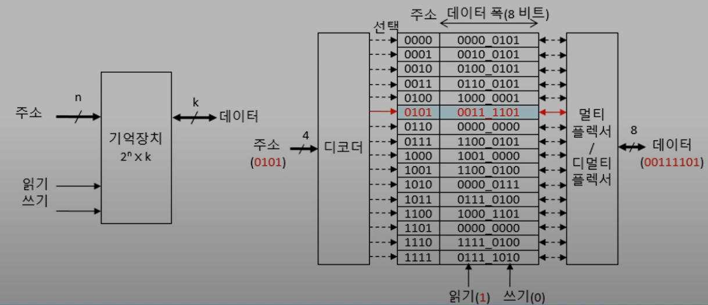
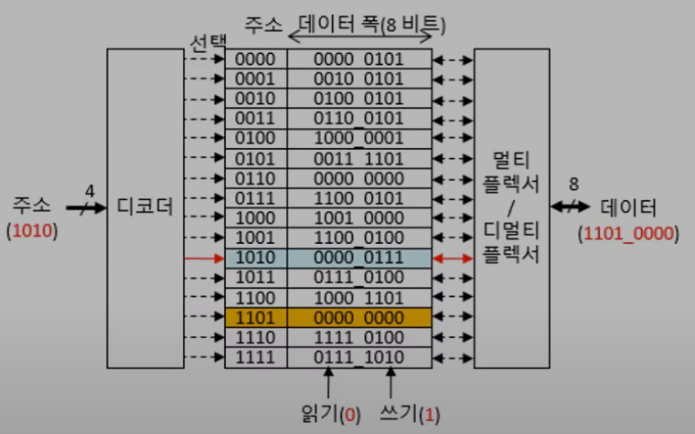

# 7.2 컴퓨터 구성 요소
* 컴퓨터의 세가지 구성 요소인 중앙처리장치, 주기억장치, 입출력 장치의 기능을 이해한다.

***

## 중앙처리장치
* 명령어 사이클을 반복 실행하여 프로그램을 실행한다.

### 인출 단계
* 동작: 기억장치에서 명령어를 하나씩 가져온다.
  * 필요한 구성 요소(2개의 레지스터가 필요)
    * PC(Program counter): 다음에 실행할 명령어가 들어있는 기억장소 주소를 저장한다.
    * IR(Instruction register): 현재 실행하고 있는 명령어를 저장한다.
  * IR ← Mem[PC], PC ← PC[명령어의 길이]
    * PC값을 메모리 주소로 지정하고 메모리 주소의 값을 읽은다음 IR레지스터에 저장, PC값은 증가(다음 명령어를 위해)

### 실행 단계
* 필요한 구성 요소 (IR, PC 외에도 데이터를 처리하기 위한 내부 레지스터들이 있다.)
  * 내부 레지스터(internal registers): 처리할 데이터를 임시 저장한다.
  * 연산기(ALU, Arithmetic and Logic Unit): 데이터 연산을 담당한다.
* 동작
  * IR의 명령어를 해석하여 실행한다.
  * 명령어마다 수행하는 일이 다른다. (인출 단계는 명령어와 관계 없다)

***

## 중앙처리장치 내부 구조
### 대략적인 처리 순서
1. 카운터의 값이 주소 버스를 통해 메모리로 간다.
2. 명령어가 인출돼서 데이터 버스를 통해 IR로 이동한다.
3. 명령어가 제어장치로 이동된다.
4. 제어장치가 IR의 명령어 코드를 해석한다.
5. 명령어를 실행하기 위한 제어신호를 생성한다.(중앙처리장치 외에도 컴퓨터 모든 부분으로 전달된다.)

※ 상태신호는 제어장치가 명령어를 실행할때 처리장치의 상태를 볼 필요가 있을때 사용 된다. 
* ex) if (x > 10) 이러한 코드가 있을때 x가 10보다 큰지 아닌지를 제어장치에 상태신호로서 넘겨주게 된다

### 제어장치
* IR의 명령어 코드 해석
* 명령어를 실행하기 위한 제어신호 생성

### 처리정치
* PC: 다음에 실행할 명령어의 주소 저장
* IR: 현재 실행 중인 명령어 저장
* 내부 레지스터: 데이터 임시 저장 (명령어 실행단계에서 쓸 레지스터)
* 연산기: 데이터 조작(산술연산, 논리연산)

### 버스 (선 개념으로 이해)
* 내부 버스
* 외부 버스: 주소 버스, 데이터 버스, 제어 버스

***

## 주기억장치
* 주기억장치: 프로그램과 데이터를 저장하는 (거대한) 1차원 배열
  * 배열이기에 인덱스(address)가 존재
  * 각 주소마다 데이터가 들어간다. 일반적으로 1칸에 8비트가 들어간다.
  * 읽기 동작 = 데이터를 출력한다.
    * 읽기 동작때는 멀티플렉서가 동작한다.
  * 쓰기 동작 = 외부에서 데이터가 들어온다.
    * 쓰기 동작때는 디멀티플렉서가 동작 한다.
* 기억장치 용량: 2^n * k bit
  * n = 주소의 비트 수, k = 방 하나의 데이터 비트 수
  * 2^n = 방의 수, k bit = 한개의 방에 있는 데이터 폭
* 적재(Load): Register ← Mem[address] // 기억장치 읽기
  * 기억장치에 있는 주소에서 데이터를 읽어 CPU안에 있는 레지스터로 가져오는 동작
* 저장(Store): Mem[address] ← Register // 기억장치 쓰기
* 단어(Word): 중앙처리장치가 한번에 액세스 하는 데이터 비트 수
  * 번역이 좀 이상하게 돼어있지만 이건 한국어의 한계
  * 보통 CPU 안에 있는 레지스터, 데이터 버스 비트 수, 연산기가 한번에 처리하는 데이터 비트 수 와 연관이 있다.

### 예제 // 그림은 2^4 * 8bit 용량의 기억장치다.
1. 읽기가 1이기 때문에 적재 동작
2. 디코더가 0101 주소를 enable
3. 0101 번지의 값이 멀티플렉서를 통해 데이터 버스로 나오게 된다.

1. 1010번지 방이 선택된다.
2. 쓰기 동작이기에 데이터가 디 멀티플렉서를 거쳐서 1010안으로 들어가게 된다.
3. 현재는 0000_0111 이지만 해당 동작 이후 1101_0000 으로 바뀌게 된다.

