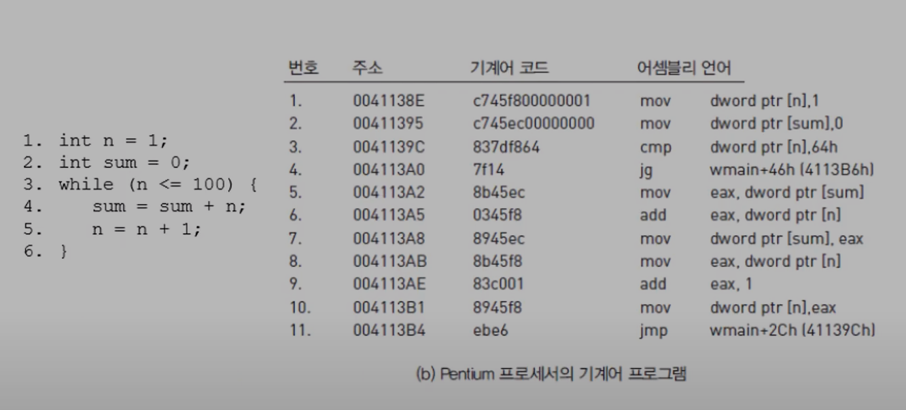
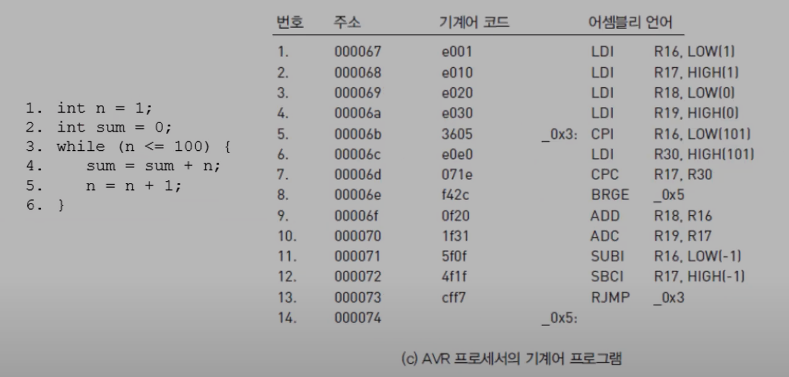
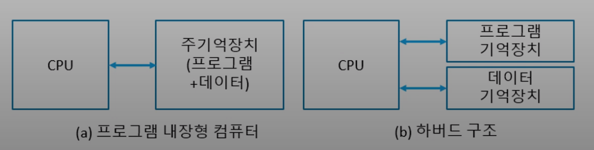
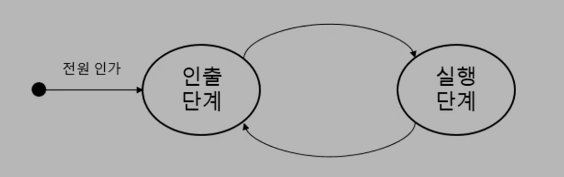

# 7.1 프로그램 실행
* 프로그램은 기억장치에 차례대로 적재되어 있는 기계어 명령어
* 기계어 명령어를 하나씩 중앙 처리 장치로 가져와서 실행하는 명령어 사이클{인출 단계, 실행 단계} 반복

***

## 기계어 프로그램
### 컴퓨터
* 프로그램을 실행하는 기계
* 프로그램은 기계어(machine instructions)의 모임
* 기계어 명령어를 실행하는 기계

### 기계어(machine language)
* 2진수 코드로 표현한 명령어.
* 프로세서 종류별로 길이가 다를수 있다.
* 고급 언어 프로그램을 컴파일러가 기계어로 번역한다.

### 어셈블리 언어(assembly language)
* 의미를 쉽게 알수 있도록 기호(니모닉 코드) 로 표현한 명령어
* 어셈블러는 어셈블리 언어 멸령어를 기계어로 번역한다.

***

## Pentium 프로세서 기계어 프로그램

* 번호: 일련번호
* 주소: 기계어 명령어가 적재되어있는 주소
* 기계어 코드: 16진수로 표현되어 있는 기계어 코드
* Pentium 기계어 코드는 명령어 종류마다 길이가 다른걸 알수 있다.
* 명령어는 기억장치에 차례대로 적재되어 있다.

***

## AVR 기계어 프로그램

* AVR 기계어 코드는 길이가 같다.
* 기계어 프로그램은 프로세서 종류마다 다르다.

***

## 프로그램 내장형 컴퓨터
### 프로그램 내장형(stored program) 컴퓨터
* Von Neumann형 컴퓨터
* 프로그램과 데이터를 주기억장치에 저장한다.
    * 프로그램: 명령어 순서열
    * 데이터: 처리할 데이터
    * 주기억 장치: RAM(VRAM), ROM
    * 보조기억 장치: SSD, HDD, 플로피 디스크, 자기테이프, ODD, 외장 하드, CD
* 명령어를 한 개씩 중앙처리장치로 가져와 실행한다.

### 기억장치 구조
* 일반 구조: 한 개의 기억장치에 프로그램과 데이터를 함께 저장한다.
  * 통로가 하나밖에 없어서 데이터를 가져오거나 프로그램을 가져오거나 한번에 하나씩 한다.
* 하버드 구조: 프로그램과 데이터를 별도의 기억장치에 저장한다.
  * 두가지 동시에 할수 있다.(현재 많이 사용)

***

## 명령어 사이클
## 명령어 사이클 = 머신 사이클 = {인출 단계, 실행 단계}
* 인출 단계(fetch cycle)
  * 주기억장치에서 명령어를 중앙처리장치로 가져온다.
* 실행 단계(execution cycle)
  * 중앙처리장치에서 명령어를 해독하고 실행한다.
* 컴퓨터는 전원이 꺼질때까지 무한히 명령어 사이클을 반복한다.

