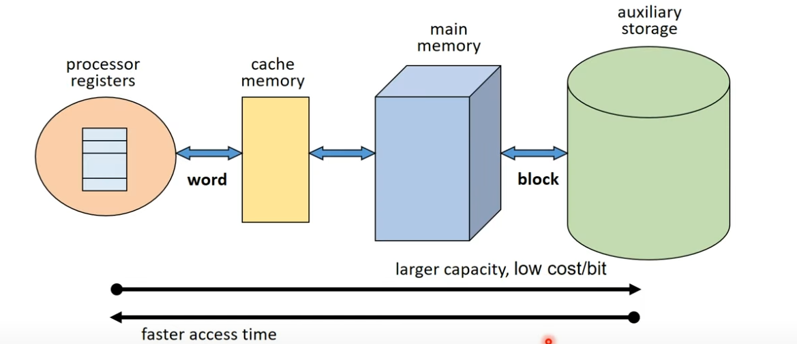
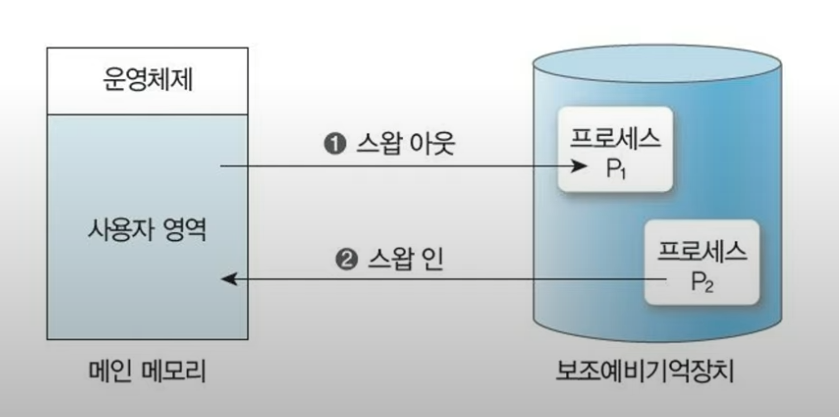

# 메모리(주기억장치) 관리

일반적으로 메모리라 하면 보통 메인메모리를 말한다.

이러한 계층구조를 가지게 된 원인은 앞에서 말한것처럼 I/O bottleneck 을 해소하기 위해 이러한 계층구조를 가지게 돼었다.

이러한 계층구조를 다시 HW가 관리하는지, SW가 관리하는지 2가지 로 나눌수 있다.

**HW가 관리 (CPU 내부에 있는 메모리)**
* 레지스터
* 캐시

**SW가 관리 (여기서 말하는 SW는 OS를 의미한다)**
* 메인 메모리
* 보조 기억장치

***

# Block & Word

어떠한 데이터를 **Disk**에서 **1bit** 읽는다고 하였을때, 메모리에 얼마만큼 올라가게 됄까?

정답은 OS가 **Disk** 에서 **주기억장치** 로 데이터를 올릴 최소 단위에 의해 결정된다. 그 단위를 부르는 용어가 **Block** 이다.

즉, **Block**이란 **보조기억장치** 와 **주기억장치** 사이의 데이터 전송 단위라 할수 있다. 보통 1kb ~ 4kb 사이의 값을 가진다. 결국 1bit를 읽더라도 1kb ~ 4kb 사이의 값이 메모리로 올라오게 된다.

연산을 하기 위해 **주기억장치**에서 **레지스터** 공간 안으로 데이터를 가져올때의 크기는 **Word** 라는 데이터 전송 단위에 의해 결정된다. 보통 16bit ~ 64bit 사이의 값을 가진다.

64bit/32bit 컴퓨터를 결정하는 요인은 **CPU 레지스터 크기** 에 의해 결정돼지만, **Word** 또한 레지스터의 크기에 의해 결정돼므로, **Word's size bit 컴퓨터** 라고도 할수 있다.

즉, 64bit 컴퓨터는 레지스터 하나의 크기가 64bit고 Word 크기도 64bit다.

Block 이란 다양한 분야에서 사용되는 일반적인 용어중 하나로, cache와 memory에서 사용하는 block의 크기는 다를 수 있다.
***

# Address Binding
[검증된 문서](https://www.baeldung.com/cs/address-binding-in-operating-systems)

`int a;` 이 코드를 예로들면 `a`는 프로그램 입장에서 본 **논리주소** 이고 메모리 어딘가 실제 공간을 가지고 있는 하드웨서상의 주소를 **물리주소** 라고 부른다.

**Address Binding** 이란 이러한 **논리주소**를 실제 메모리의 **물리주소**로 **매핑(mapping)** 해주는 작업이다.

**Address Binding 은 어느 시점에 하느냐에 따라 크게 3가지로 구분된다.**
* Compile time binding
* Load time binding
* Run time binding

해당 그림은 어떠한 프로그램이 실제로 실행하기 까지의 과정을 요약한거다.

Source code -> **Compiler** -> Object module
* 컴파일 하는 순간 이루어지는 Binding을 Compile time binding 라고 부른다.

Object module -> **Linker** -> **Load module** -> **Loader**
* Linker 부터 Loader 까지의 과정을 Load time 라 말하고 이때 이루어지는 Binding을 Load time binding 라고 부른다.

Loader -> **In-memory binary image(메모리에 올라와 실행중인 상태)**
* **실행 시간**에 이루어지는 Binding을 Run time binding 라 부른다.

## Compile time binding
컴파일할때 메모리 주소를 정해주는것이다, 그리고 이를 이루려면 프로세스가 Memory에 적재될 위치를 컴파일러가 모두 다 알수 있어야 한다, 쉽게말해 컴파일러가 Memory를 완전히 이해해야 한다.

컴파일러가 `int a; int b` 와 같은 프로그램의 주소를 모두 정해놨기 때문에 해당 프로그램은 항상 같은 주소에 올라가야 하며, **중간에 위치를 변화시킬수 없다.**

Memory의 위치를 이미 정해놨기 때문에, 프로그램 전체가 메모리에 올라가야 한다.

## Load time binding
메모리 적재 위치를 컴파일 시점에서 모르면, 대체 가능한 상대 주소를 생성할 수 있다, 예를들어 시작주소를 `u` 라 가정하고 해당 `u` 부터 100까지 떨어져 있으면 `u + 100` 이런식으로 주소를 **상대적으로** 저장 해놓는다라는 의미다.

적재시점(load time, 실제 메모리에 올라갈 때)에 시작주소를 반영하여 사용자 코드 상의 주소를 재설정 한다.

상재주소를 이미 다 정해놨기 때문에, Compile time binding과 마찬가지로 프로그램 전체가 메모리에 올라가야 한다.

## Run time binding
load time 까지 놔뒀다가 실제로 수행 될때(running-state) address를 정해 주겠다는 의미다. 즉,`ready-state` -> `running-state` 로 갈때 마다 address를 정해주겠다는 것이다.

프로세스가 수행 도중 다른 메모리 위치로 이동할 수 있음을 의미한다.

이러한 작업을 하기 위해 HW의 도움이 필요하고 이를 **MMU(Memory Management Unit)** 라 부른다.

대부분 OS가 사용한다.

***

# Dynamic Loading
프로그램이 Memory에 모두 적재하는것이 불가능 할때 혹은 그럴필요 없을때, 모든 루틴(쉽게 말하면 함수 같은것)을 **교체 가능한 형태**로 **디스크에 저장**하는 것이다.

`fun a`, `fun b`, `fun c` 가 있다면 이것들을 디스크에 저장을 해놨다가, Process가 `fun a`를 호출 하면 그때 `fun a`를 Memory에 올리는 형태다, 그리고 자연스럽게 `fun a`가 올라오는 시점(호출 시점)에 address가 binding 된다.

메모리 공간을 효율적으로 사용하다는 장점이 존재 한다.

***

# Swapping

Process 상태 전이를 이야기 할때 봤던 내용이다.

어느 상태에 있다가 Memory를 뺐기는것을 swap-out 이라 하고, swap-out 이란것은 Memory image를 swap-device에 저장하는것이다, 반대로 swap-device에 있다가 다시 Memory로 올라오는것은 swap-in 이다.