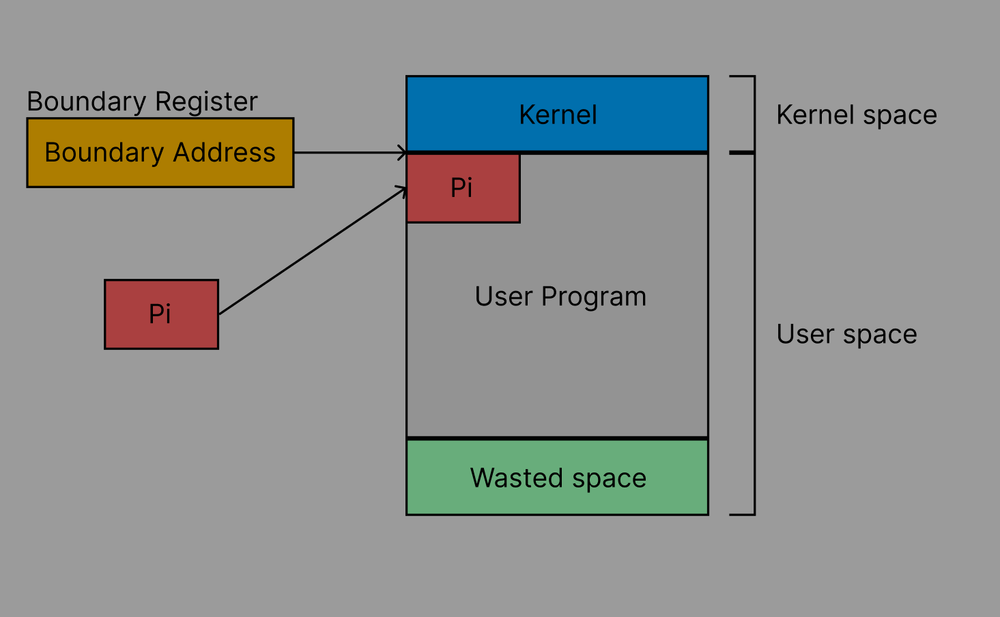
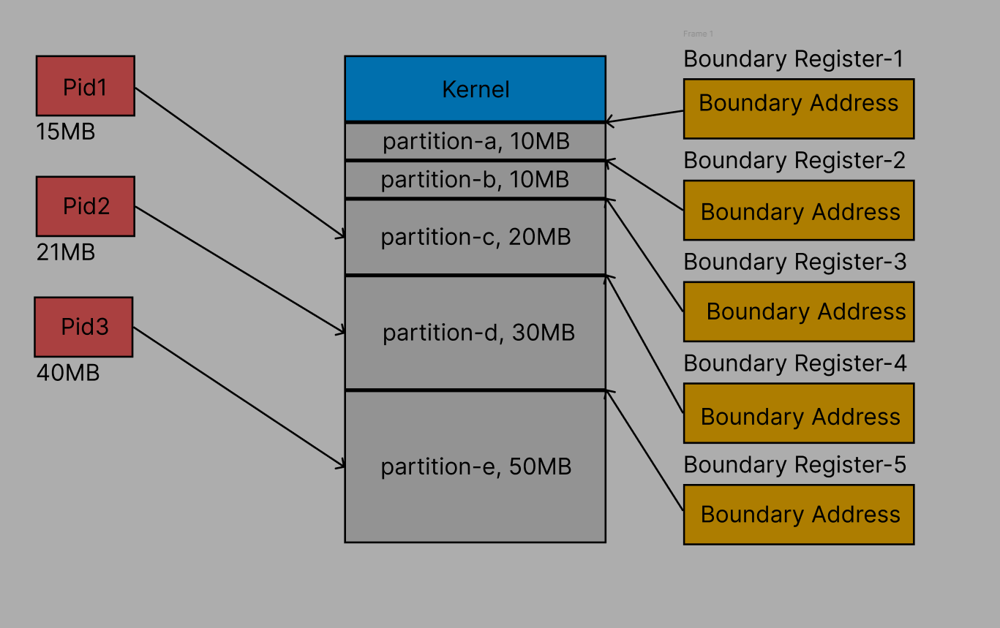
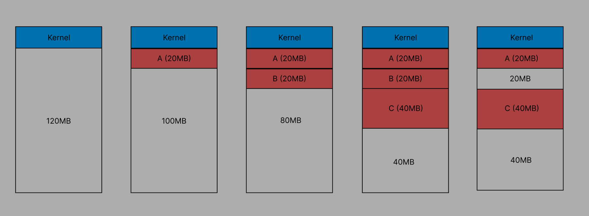

# Memory Allocation
이름 그대로 Memory를 어떻게 Process에게 Allocation 할지에 대한 이야기다.

# Continuous Memory Allocation - 연속할당
Process(context)를 **하나의 연속된 메모리 공간**에 할당하는 정책이다, 자연스럽게 Program, data, stack 등이 포함된다, 그리고 프로그램 전체가 한번에 Memory에 올라가야 한다.

한 Process가 있을때 이 Process가 그대로 Memory 공간에 올라가는 이미지를 그리면 된다.

CMA 정책을 적용할때 생각해봐야 할 문제들은 다음과 같다.
1. 메모리에 동시에 올라갈 수 있는 Process 수
2. 각 Process에게 할당되는 Memory 공간 크기
3. Memory 분할 방법

***

# Uni programming

Multiprogramming degree 가 1인 경우, 즉 한번에 하나의 Process만 올라가는 경우를 의미한다. 가장 간단한 메모리 관리 기법이기도 하다.

하지만 이때 프로그램의 크기 > 메모리 크기 인 경우, 프로세스가 Kernel을 침범할 가능성 등을 고려해야 한다.

## Kernel 보호
Boundary register에 Kernel의 경계가 돼는 지점의 Address를 저장해, Kernel을 침범하는것을 막을수 있다.

## Overlay structure

이 때 공통된 영역만 Memory에 적재하고 공통돼지 않은부분은 구분해서 따로따로 번갈아가면서 적재하는 기법인 **Overlay structure** 방법을 사용할수 있다.

## 문제점
프로그램의 공통됀 부분과 그렇지 않은 부분을 고려해 따로따로 적재하는건 OS가 **하지 못한다.** 결국 **사용자 혹은 프로그래머가 해야할 일**이다. 즉 사용자 혹은 프로그래머가 프로그램의 흐름 및 자료구조를 완벽히 이해하고 있어야 한다는 단점이 존재한다.

하나의 Process만 적재돼니 자연스럽게 나머지 공간은 **낭비**돼는 Low system resource utilization, Low system performance 문제점이 존재한다.

***

# Multi programming - Fixed partition
Fixed partition Multi programming 이란 메모리 공간을 고정된 크기로 미리 분할해 놓는 기법이다. Uni programming 과 마찬가지로 메모리 관리가 매우 **간편**한 편이다.

Process 가 도착하면 각 분할된 partition중 적당한 공간에 적재시키면 됀다, 각 프로세스는 하나의 partition에만 들어갈수 있는 구조로 만들어 진다.

즉, partition의 수가 Multiprogramming degree의 수가 됀다.

## 자료구조
Fixed partition Multi programming 을 구현하려면 이러한 구조로 자료구조를 먼저 생각하면 됀다.

| partition | start address | size | current Process ID | other fields |
|-----------|---------------|------|--------------------|--------------|
| partition-a | a1 | 10MB | --- | ... |
| partition-b | a2 | 10MB | --- | ... |
| partition-c | a3 | 20MB | Pid1 | ... |
| partition-d | a4 | 30MB | Pid2 | ... |
| partition-e | a5 | 50MB | Pid3 | ... |

## 커널 및 사용자 영역 보호
Kernel 뿐만 아니라 각 partition 도 보호해야 한다, 각 partition 마다 Boundary register을 두어 해결할수 있다.

## Fragmentation - 단편화
위 그림에서 partition-e 의 크기는 50MB 지만 내부에 적재돼어 있는 Process는 40MB 이다. 이때 발생하는 10MB 공간은 다른 Process가 사용할수 없는 공간으로 **메모리 낭비**가 된다. 이를 정리하여, `Partition 크기` > `Process 크기` 이런 경우를 **Internal fragmentation(내부 단편화)**  라고 한다.

위 그림에서 남은 메모리 공간의 크기는 120MB - 76MB = 44MB 이다. 이순간, 30MB 크기의 Pid4가 들어오려고 하면 어느 공간에 할당받을수 있을까? 정답은 **적재할수 없다.** 이러한 `남은 메모리 크기` > `Process 크기` 현상을 **External fragmentation(외부 단편화)** 라고 한다.

***

# Multi programming - Variable Partition
파티션이 유동적으로 변화 가능하다 라는 의미다.

케이크에 비유를 하면, Fixed partition 방법은 **미리 케이크를 잘라놓은 다음** 사람이 오면, 각 사람이 배고픈 만큼 케이크를 알아서 가져가는 것이라면, Variable Partition 은 **케이크를 미리 자르지 않고**, 사람이 오면 그 사람이 **배고픈 만큼 케이크를 잘라 주는** 방식이다.

즉, Variable Partition 방식은 **초기엔 Memory 공간 전체가 하나의 영역**이 되며, 프로세스가 Memory를 요청 하면 메모리 공간을 **동적으로 분할** 하는 방법이다.

그때그때 딱 맞춰서 Memory를 할당하면 돼니 Internal fragmentation 이 **발생하지 않는다.**

## 예시
처음엔 하나였다가 Process가 들어올때 마다 동적으로 partition이 구성돼는것을 볼수 있다, 그러므로 Internal fragmentation 이 존재하지 않는것을 확인할 수 있다.

| partition | start address | size | current Process ID | other fields |
|-----------|---------------|------|--------------------|--------------|
| 1 | u | 120MB | none | ... |

| partition | start address | size | current Process ID | other fields |
|-----------|---------------|------|--------------------|--------------|
| 1 | u | 20MB | A | ... |
| 2 | u + 20 | 100MB | none | ... |

| partition | start address | size | current Process ID | other fields |
|-----------|---------------|------|--------------------|--------------|
| 1 | u | 20MB | A | ... |
| 2 | u + 20 | 20MB | B | ... |
| 3 | u + 40 | 80MB | none | ... |

| partition | start address | size | current Process ID | other fields |
|-----------|---------------|------|--------------------|--------------|
| 1 | u | 20MB | A | ... |
| 2 | u + 20 | 20MB | B | ... |
| 3 | u + 40 | 40MB | C | ... |
| 4 | u + 80 | 40MB | none | ... |

| partition | start address | size | current Process ID | other fields |
|-----------|---------------|------|--------------------|--------------|
| 1 | u | 20MB | A | ... |
| 2 | u + 20 | 20MB | none | ... |
| 3 | u + 40 | 40MB | C | ... |
| 4 | u + 80 | 40MB | none | ... |

마지막 그림에서 만약 B가 할일을 끝내고 나갈시 **파티션이 나누어 졌으면서 아무도 안쓰는 상태**의 Memory가 생기게 된다.

여기서 만약 Process 의 크기가 15MB 인 Process D가 Memory에 들어오려고 할때, 어떤 partition에 배치할까?

혹은 Process의 크기가 50MB인 Process E가 Memory에 들어오려고 한다면 어떻게 배치해야 할까?

## Placement strategies[배치 전략] - First fit
처음부터 순차탐색을 하면서 **충분한 크기를 가진 첫 번째 partition**을 선택하는 전략이다. simple하고 overhead가 적은 장점이 있다.

위 그림을 예로 들면 2번 partition에 Process D가 들어가게 될것이다.

하지만 그렇게 됀다면 2번 partition 에는 5MB의 남은 공간이 발생하게 된다. 이렇게 된다면, 남아있는 5MB 의 크기가 너무 작아 다른 Process가 배치돼지 않아 **자원 활용률이 떨어질 수 있다.**

그리고 만약 2번 partition이 50MB 였다면 50MB Process를 배치할 수 있지만, 작은 크기의 Process D 때문에 큰 Process를 담을 수 없는 문제점도 생긴다.

## Placement strategies[배치 전략] - Best-fit
처음부터 끝까지 순차탐색을 진행하여 Process가 들어갈 수 있는 partition 중 **남아있는 공간이 가장 작은 곳**을 선택하는 탐색 기법이다.

위 예로 들면 Process D는 partition 2에 들어가게 될것이다.

크기가 큰 partition을 유지할 수 있는 장점이 있다.

하지만 중간에 끊을수 있는 First-fit에 비해 모든 partition을 검사해야 하니 **탐색 시간이 오래 걸린다(overhead 가 크다).**

그리고 작은 크기의(활용하기 너무 작은) partition이 많이 발생할 수 있다.

## Placement strategies[배치 전략] - Worst-fit
Best-fit 과 반대로 남이있는 공간이 가장 큰 곳을 선택하는 탐색 기법이다, 마찬가지로 **탐색 시간이 오래 걸린다(overhead 가 크다).**

위 예로 들면 Process D는 partition 4에 들어가게 될것이다.

그리고 작은 크기의(활용하기 너무 작은) partition의 발생을 줄일 수 있지만, 큰 공간을 유지할 수 없는 단점도 있다.

## Placement strategies[배치 전략] - Next-fit
위 전략대로면 보통 Memory의 처음 지점 주변에 집중적으로 배치될 가능성이 크다. Next-fit은 First-fit의 시작지점을 마지막으로 State table에서 마지막으로 탐색한 위치로 매번 업데이트 시켜주는 전략이다.

위 그림대로면 Process D는 partition 2 에 배치될것이고, 그 다음 Process는 partition 2 부터 순차 탐색이 진행 되게 된다.

First-fit 의 장점인 Low overhead를 가지면서 메모리 영역의 사용을 비교적 균등화 할수 있다.

## Placement strategies[배치 전략] - Coalescing-holes[공간 통합]
이번엔 반대로 External fragmentation 을 해결하기 위한 방법이다.

Coalescing-holes 이란 인접한 **빈 영역을 하나의 partition으로 통합**하는 기법이다.

통합을 할 타이밍은 Process가 memory를 release 하고 나가면 수행하면 된다. 자기 자신의 양 옆을 합해 주는걸로 해결할 수 있기 떄문에 **overhead가 적은 방법**이다.

위 그림에선 A가 끝난다면 partition은 20MB + 20MB = 40MB로 통합돼게 된다. 하지만 아직 Process E가 들어갈수 없기 때문에 **Process E는 계속 대기하다가**, Process C가 끝나고 partition이 통합 된 후 Memory에 적재돼게 된다.

## Placement strategies[배치 전략] - Storage Compaction[메모리 압축]
External fragmentation 을 해결하기 위한 두번 째 방법으론 메모리 압축이 있다.

이 방법은 중간에 Memory가 비어있다면, **Process의 위치들을 한곳으로 몰아넣어** 한 큰 공간을 만드는 방법이다.

위 그림에선 A 와 C가 붙어있기 때문에, 60MB 크기의 Memory가 남게 되므로 E가 들어 갈 수 있게 된다.

하지만, 모든 Process 들을 재배치 해야 한다는 뜻은, 모든 Process들을 잠시 중지 한다는 의미와 같다, Process를 중지한다는것은 **overhead가 매우 큰 행위**다, 그러므로 자주 해주는 것 보단, 일정 시간, 혹은 요청이 있을때 같은 특별할 때만 해주는 방식으로 운용이 된다.
