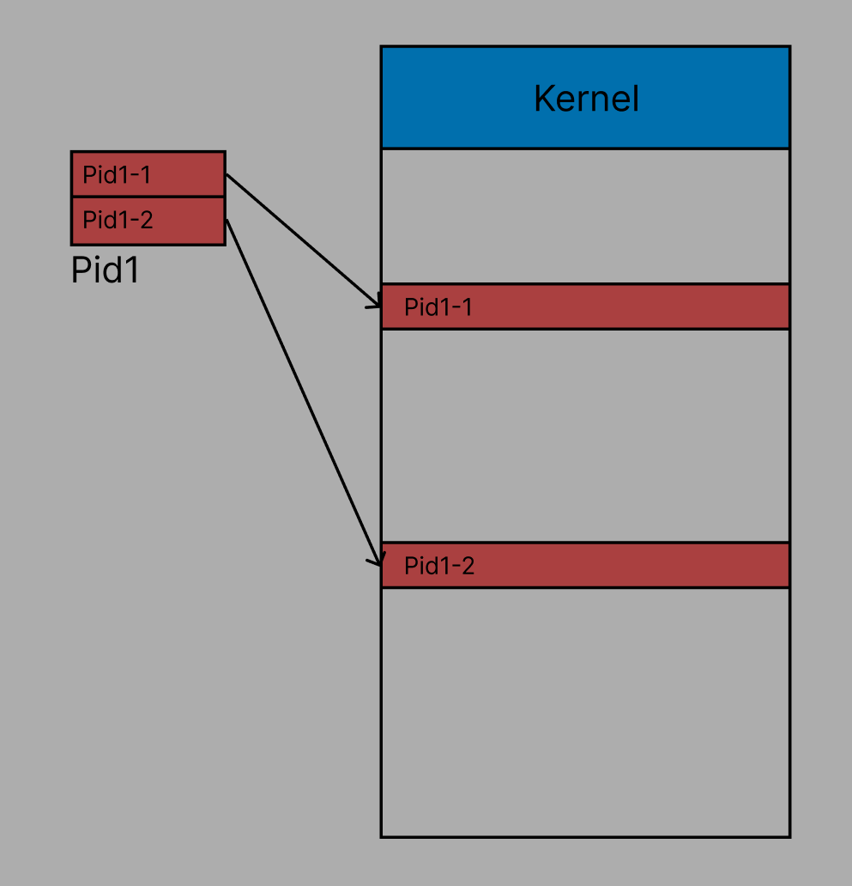
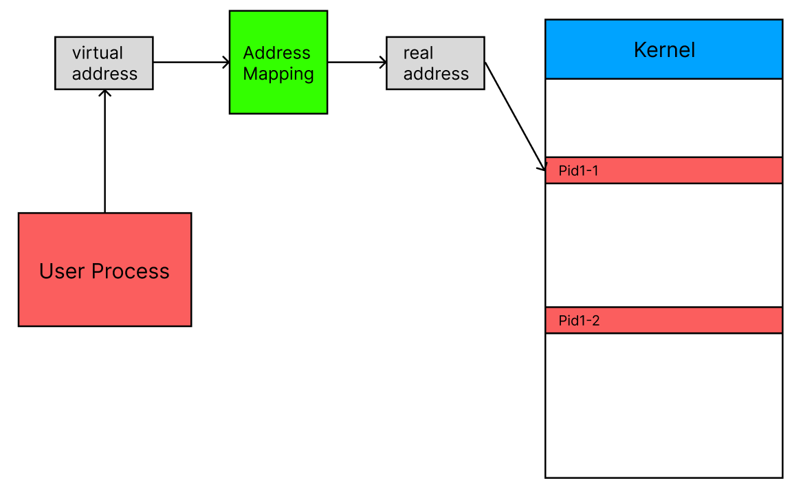
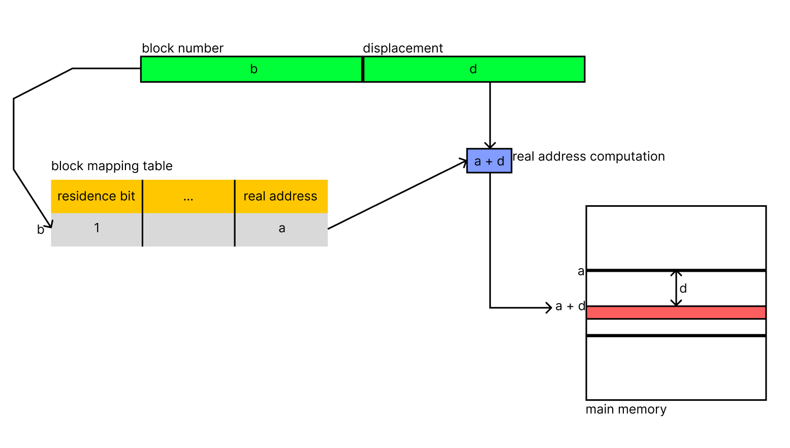

# Non-Continuous-Allocation

Process가 나누어진 상태에서 Memory에 Allocation 기법을 이야기 한다.

사용자 프로그램을 여러개의 block으로 분할하고, **실행시 필요한 block들만 Memory에 적재** 하게 된다. 나머지 block들은 swap device에 존재한다. swap device란 그냥 쉽게 disk라고 이해해도 좋다.

***

# Address Mapping - Continuous allocation
이전 Continuous allocation 에서 Address Mapping을 수행할 시, **Relative address(상대 주소)**와 **Relocation(재배치)** 개념이 있었다.

간단히 정리하자면 프로그램의 **시작 주소를 0으로 가정한 주소인 Relative address** 와 Memory 할당 후, **할당 된 주소(allocation address) 에 따라 주소들을 조정**하는 작업이다.

[1]개요.md 에서 Load time binding 과 Run time binding 에서 Continuous allocation 이 Address Mapping을 어떻게 하는지에 관해 자세히 나와 있다.

***

# Address Mapping - Non Continuous Allocation
NCA를 생각해보면, 프로그램이 분할 된 후 Memory에 적재돼게 된다. 하지만 프로그래머들은 이를 고려하지 않고 프로그래밍을 하는것이 대부분이다.

이를 가능하게 해주는 개념이 바로 Virtual address와 Real address 다.

Virtual Address 란, relative address와 비슷한 개념으로, Logical address를 말한다.

Logical address란, Process가 할당된 Memory는 실제론 잘려진 상태로 적재 돼어있지만 이를 마치 **연속된 Memory 처럼 쓸수 있도록** Memory 할당을 논리적으로 가정한 주소이다.

Real address 또는 Absolute address 또는 Physical address는 실제 Memory에 적재된 주소를 의미한다.

즉, NCM에서 Address mapping 이란 **Virtual address를 Real address로 바꾸어 주는것**을 이야기 한다.

[TODO: 내가 정리했지만 교수님한테 한 번 물어볼까 싶다.]
다음을 정리해보면, Processor 가 어떤 Memory를 요청할시, 연속적으로 적재되어 있다고 가정한 Process에서 Virtual Address를 가져온 다음 Address Mapping 작업을 거져 Real Address 로 바꾸어 Memory에 접근하는 그림을 그릴수 있다.

***

# Address Mapping 기법 - Block Mapping
사용자 프로그램은 block 단위로 분할/관리 돼고 있는데, 이러한 block들을 어떻게 address mapping 하는지 기본적은 개념을 소개하겠다.

Block Mapping에서 Virtual address 는 **(b , d) 로 구성돼어 있다.**
* **b:** block number -> block의 번호
* **d:** displacement(offset) in the block -> block의 번호의 시작점으로부터 **얼마만큼 떨어져 있는지**에 대한 정보

TODO

## Block map table
그렇다면 어떻게 Address mapping 정보를 관리 할까? 이는 BMT를 통해 관리하게 된다. 그리고 block이란건 Process 하나를 나누었다고 가정 하는것이기 때문에 Process 마다 존재하게 된다.

정리하면 나누어진 Process를 관리하기 위해 Kernel 공간에 한 프로세스마다 하나의 BMT를 가진다.

각 block은 번호를 가지고, 해당 block이 Memory에 실제로 올라 갔느냐에 대한 정보인 residence bit이 있다. 올라가 있지 않은 block은 swap device에 존재한다. 그리고 실제로 올라갔다면 **어디에 올라가 있느냐**인 real address 가 있다.

| block number | residence bit | ... | real address |
|--------------|---------------|-----|--------------|
| 0            |               | ... |              |
| 1            |               | ... |              |
| 2            |               | ... |              |
| ...          |               | ... |              |
| b            | 1             | ... | a            |

## 예시

[TODO: Processor가 V-memory에 요청 한다고?]
Block Mapping은 이런 순서로 동작하게 된다.
1. 어떤 데이터가 필요하면 **Process의 BMT에 접근**해 block number에 대한 항목을 찾는다.
2. Residence bit를 검사한다.
    1. `Residence bit = 0` 인 경우, **swap device에서 해당 블록을 Memory로 가져 온 후**, BMT를 업데이트 한다. 그리고 3-2 를 수행한다.
    2. `Residence bit = 1`인 경우, BMT에서 b에 대한 real address 값 a를 확인한다.
3. 실제 주소인 a + d 를 계산한다.
3. 해당 주소를 이용하여 메모리에 접근한다.
